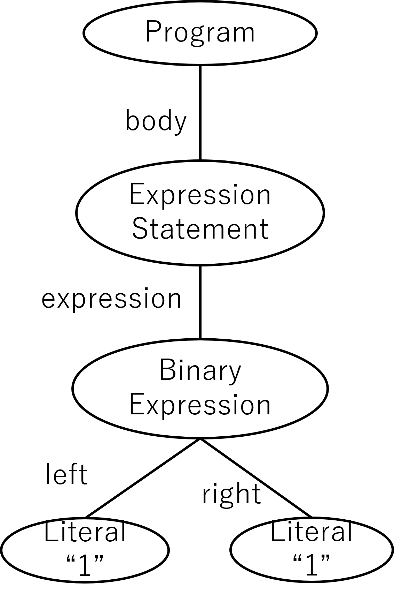

# 練習問題: 2 章

## 問題 2.1 💻

第 1 章のヒストグラムのコードにフォーマッターを実行してコードを整形しなさい。

**出題範囲**: 2.1

## 問題 2.2 🖋

$ や \_ を変数名として利用するライブラリを調べなさい。

**出題範囲**: 2.4

## 問題 2.3 💻🖋

本の文中では Unicode 正規化について é を例にして説明されていますが、それぞれの正規化にはそれぞれ名前がついています。
é を 1 つの Unicode 文字とする正規化を NFC (Normalization Form Canonical Composition)、e とアクセント結合マークに分離する正規化を NFD (Normalization Form Canonical Decomposition) といいます。

Unicode の正規化は日本語のひらがな、カタカナの濁音"゛"や半濁音"゜"にも適用されます。以上を踏まえて、

1. "パン"を Unicode エスケープシーケンスで記述した文字列リテラルを NFC と NFD のそれぞれの形式で作ってください。💻
2. 濁音や半濁音を含むファイル名のファイルを作ったとき、Windows と macOS では NFC と NFD どちらの形式で保存されるかを調べて記述しなさい。🖋

**出題範囲**: 2.5.2

## 問題 2.4 💻

Unicode エスケープシーケンスをなるべく用いて"Hello,World"を出力するプログラムを書きなさい。

**出題範囲**: 2.5.1

## 問題 2.5 💻📄

第 1 章のヒストグラムのコードからセミコロンを可能な限り排除しなさい。

**出題範囲**: 2.6

## 問題 2.6 📄

FizzBuzz 問題の結果を文字列として返す関数を 1 行で書きなさい。1 から 100 まで繰り返すこと。文字列は与えられたテストを通過する形式にすること。

**出題範囲**: 2.6

## 問題 2.7 🖋

以下のプログラムを実行し、挙動を確認しなさい。

```ts
let a = 0,
  b = 0;

// prettier-ignore
const c
=
a
// prettier-ignore
++
b

console.log(a, b, c);

// prettier-ignore
const e = a++
b;

console.log(a, b, e);
```

**出題範囲**: 2.6

## 問題 2.8 🖋

プログラム言語のソースコードの構造は、抽象構文木 (AST) で表現することができる。ソースコードを AST に変換して解析することで、最適化や lint の検出など、ソースコードの変換や検証を行うことができる。
書籍 p.22 の以下の2つのプログラムをそれぞれ AST に変換し、JSONとして出力しなさい。AST を生成するために [acorn](https://www.npmjs.com/package/acorn) などのJavaScript のソースコードをパースして抽象構文木 (AST) を生成するライブラリを使っても良い。

``` javascript
let a
a
=
3
console.log(a)
```

``` javascript
let a; a = 3; console.log(a);
```

また、生成された AST を図で表現しなさい。例えば `1 + 1` という単純なプログラムは以下のような図で表現できる。



**出題範囲**: 2.6
