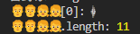

### 1. `"𠮷野家"[0]`の場合

`"𠮷野家"[0]`は`"\uD842"`を返す

- "𠮷野家"は実際は長さ4：
  1. 𠮷: `\uD842\uDFB7`
  2. 野: `\u91CE`
  3. 家: `\u5BB6`
- "𠮷"がサロゲートペアになっている。

### 2. `"👨‍👨‍👧‍👧"[0]`の場合

`"👨‍👨‍👧‍👧"[0]`は`"\uD83D"`を返す

- "👨‍👨‍👧‍👧"は実際には複数の絵文字がゼロ幅接合子で結合されている
  

  1. 👨: `\uD83D\uDC68`
  2. ZWJ: `\u200D`
  3. 👨: `\uD83D\uDC68`
  4. ZWJ: `\u200D`
  5. 👧: `\uD83D\uDC67`
  6. ZWJ: `\u200D`
  7. 👧: `\uD83D\uDC67`

### 問題7.8で得た絵文字に対する知見

1. 絵文字の正しい処理には`Intl.Segmenter`の使用が効果的

   - `granularity: 'grapheme'`を指定することで、ZWJで結合された絵文字も適切に処理できる

2. 文字列のインデックスアクセスの限界
   - JavaScriptの文字列は内部的にUTF-16でエンコードされています
   - サロゲートペアや結合文字、ZWJで結合された絵文字は複数のコードユニットで構成されるため、単純なインデックスアクセスでは正しく処理できない
   - 文字列を文字単位で扱う場合は、`Intl.Segmenter`のような適切なツールを使用する必要がある。
