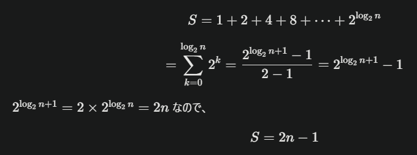

ヒント: `push` を $`n`$ 回呼び出したとき、7.10 の実装では配列を倍々にしていくので再配置は $`log_2 n`$ 回発生する。各再配置で要素のコピーは $`1, 2, 4, 8, ..., 2^{log_2 n}`$ 回発生する。再配置の際にコピー回数の総和は $`2^0 + 2^1 + 2^2 + ... + 2^{log_2 n} = ...`$ (等比数列の和の公式を思い出すこと)。この値を $`n`$ で割れば各 `push` の平均時間計算量が求められる。



`n` で割ると平均時間計算量 `O（1）`

```js
function copyA(array) {
  const result = Array(array.length);
  for (let i = 0; i < array.length; i++) {
    result[i] = array[i];
  }
  return result;
}
```

- ループはn回だから`O(n)`

```js
// NOTE: copyB よりも copyA の方が効率的に見えるが計算量の観点ではどうだろうか
function copyB(array) {
  const result = [];
  for (const v of array) {
    result.push(v);
  }
  return result;
}
```

- pushはO(1)でn回呼び出している。よってO(n)。
