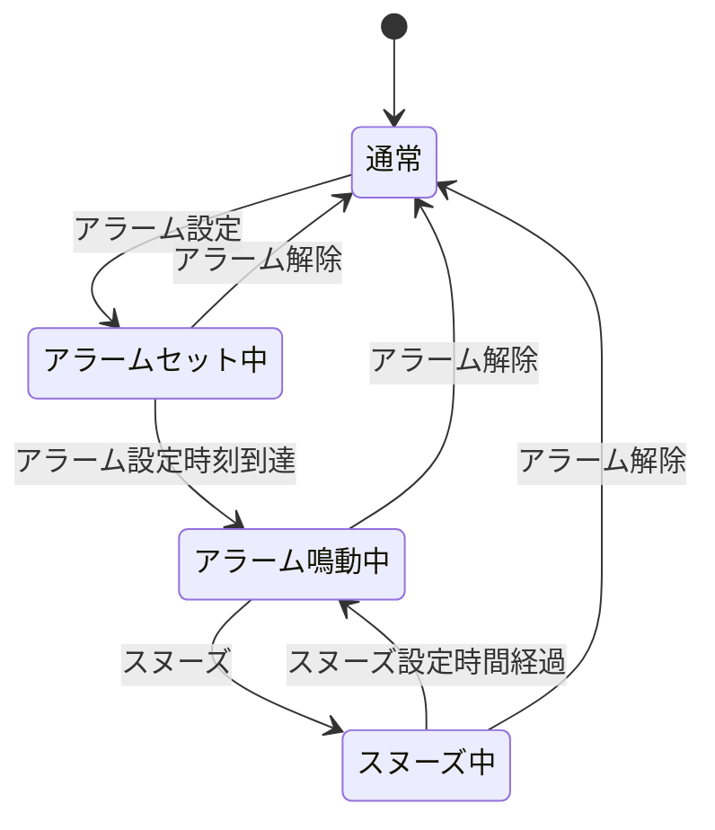

# 練習問題: 9 章

## 問題 9.1 💻📄

与えられたテストケースを満たすクラス C を作成しなさい。

```ts
import { C } from "./index.js"; // ts でも可

test("class puzzle", () => {
  expect(C.method()).toBe(1);
  expect(new C().method()).toBe(2);
  expect(C.C.method()).toBe(3);
  expect(new C.C().method()).toBe(4);
  expect(new C().C.method()).toBe(5);
  expect(new new C().C().method()).toBe(6);
});
```

**出題範囲**: 9.3.1

## 問題 9.2 💻🖋️

ゲッターメソッドは値の取得以外の処理も記述することができる。
一例として、以下のような値を読み出す度にその値が 1 ずつ増えていくゲッターを持つクラスを作りなさい(初回呼び出しは0を返す)。

また一方で、このようなクラス構造は一般的に良くないとされている。
このクラスの問題点を説明しなさい。

```ts
import { C } from "./index.js"; // ts でも可

test("", () => {
  const c = new C();
  expect(c.x).toBe(0);
  expect(c.x).toBe(1);
  expect(c.x).toBe(2);
});
```

**出題範囲**: 9.3.2

## 問題 9.3 💻🧪

以下のクラスは常に正の数値を保持するクラスで、0以下の値を保持することを許容していない。
一方で、`x`のフィールドは外部から直接アクセス可能なため、常に正の値を保持するという条件を破った状態を作ることができてしまう。
このクラスをクロージャを用いて書き直し、フィールド`x`に対して外部から直接書き換えができないようにしなさい。(実装方法はテキストP.226の例を参考にしなさい。)

```ts
class PositiveNumber {
  constructor(x) {
    if(x <= 0) {
      throw new Error("require : x > 0");
    }
    this.x = x;
  }

  getX() {
    return this.x;
  }

  setX(x) {
    if(x <= 0) {
      throw new Error("require : x > 0");
    }
    this.x = x;
  }
}
```

**出題範囲**: 9.3.3

## 問題 9.4 💻 🧪

以下の仕様に基づいて RPG の戦士クラスと魔力を持った戦士である魔法戦士クラスをそれぞれ `class` を使った記法と `prototype` を使った記法で実装しなさい。

仕様

- 戦士は攻撃力 `atk` フィールドを持つ
- 戦士は攻撃 `attack` メソッドを持つ
- `attack` メソッドはそのインスタンスの `atk` の 2 倍の値をダメージとして返す
- 魔法戦士は戦士を継承する
- 魔法戦士は魔力 `mgc` フィールドを持つ
- 魔法戦士の `attack` は戦士としての `attack` の値にそのインスタンスの `mgc` の値を加算した値をダメージとして返す

**出題範囲**: 9.5.1

## 問題 9.5 💻🧪

`instanceof`と等価な関数 `instanceOf(object, constructor)`を作成しなさい。
関数内部での `instanceof` の利用は不可。

作成した関数に対してテストを作成しなさい。
テストケースには少なくとも以下を含むこと。

- 多段に継承したクラスのインスタンスと基底クラスのコンストラクタを入力するケース
- 継承関係にないインスタンスとクラスのコンストラクタを入力するケース

**出題範囲**: 9.5.2

## 問題 9.6 💻 🧪

例 9-6 の `TypedMap` を継承ではなくコンポジションを使って書き換えなさい。処理を完全に Map に委譲するメソッドはテストを省略してもよい。

**出題範囲**: 9.5.3

## 問題 9.7 💻📄

以下のコードは`SimpleList`を継承して要素のpush回数を記録する`InstrumentedSimpleList`を実装した例である。
しかし、このコードは想定した通りに動作しない。テストコードで正しく動作していないことを確認しなさい。
この問題を回避するために、継承のかわりに合成(composition)を用いて`InstrumentedSimpleList`を修正し、テストが通るようにしなさい。

```
export class LinkedList {
  #head = null;
  #tail = null;

  constructor() {
    this.#head = null;
    this.#tail = null;
  }

  push(value) {
    const newNode = { value, next: null };
    if (!this.#head) {
      this.#head = newNode;
      this.#tail = newNode;
    } else {
      this.#tail.next = newNode;
      this.#tail = newNode;
    }
  }

  pushAll(...items) {
    items.forEach((item) => this.push(item));
  }

  toString() {
    let current = this.#head;
    const values = [];
    while (current) {
      values.push(current.value);
      current = current.next;
    }
    return "[" + values.join(", ") + "]";
  }
}

/**
 * 要素のpush回数を記録するLinkedList
 */
export class InstrumentedLinkedList extends LinkedList {
  #pushCount = 0;

  /**
   * 要素のpush操作が行われた回数
   */
  get pushCount() {
    return this.#pushCount;
  }

  push(item) {
    super.push(item);
    this.#pushCount++;
  }

  pushAll(...items) {
    super.pushAll(...items);
    this.#pushCount += items.length;
  }
}
```

**出題範囲**: 9.5.3

## 問題 9.8 💻 🧪

以下の図は、ある目覚まし時計の状態遷移をモデル化した状態遷移図である。



この状態遷移を管理するコード例として、以下のようなクラスが考えられる。
`AlarmClock` インスタンスに対して、各イベントに対応するメソッドを呼び出すと、内部で状態遷移が発生し、実行すべきアクションを返り値として返す。

```js
// 目覚まし時計の状態
export const State = Object.freeze({
  NORMAL: Symbol("normal"), // 通常
  ALARM_SET: Symbol("alarmSet"), // アラームセット中
  ALARM_SOUNDING: Symbol("alarmSounding"), // アラーム鳴動中
  SNOOZING: Symbol("snoozing"), // スヌーズ中
});

// イベント時に発生するアクション
export const Action = Object.freeze({
  NONE: Symbol("none"), // 何もしない
  SOUND_ALARM: Symbol("soundAlarm"), // アラームを鳴らす
  STOP_ALARM: Symbol("stopAlarm"), // アラームを止める
});

// 補足:
// JavaScript では 列挙型を上記のように記述するが
// TypeScript では 列挙型を `type Action = "none" | "soundAlarm" | "stopAlarm";` のように代数的データ型を使って記述するのが一般的

// 目覚まし時計クラス
export class AlarmClock {
  #state; // private な属性

  constructor() {
    this.#state = State.NORMAL;
  }

  // アラーム設定イベント
  setAlarm() {
    switch (this.#state) {
      case State.NORMAL:
        this.#state = State.ALARM_SET;
        return Action.NONE;
      default:
        return Action.NONE;
    }
  }

  // アラーム解除イベント
  cancelAlarm() {
    switch (this.#state) {
      case State.ALARM_SET:
        this.#state = State.NORMAL;
        return Action.NONE;
      case State.ALARM_SOUNDING:
        this.#state = State.NORMAL;
        return Action.STOP_ALARM;
      case State.SNOOZING:
        this.#state = State.NORMAL;
        return Action.NONE;
      default:
        return Action.NONE;
    }
  }

  // アラーム設定時刻到達イベント
  reachedToAlarmTime() {
    switch (this.#state) {
      case State.ALARM_SET:
        this.#state = State.ALARM_SOUNDING;
        return Action.SOUND_ALARM;
      default:
        return Action.NONE;
    }
  }

  // スヌーズイベント
  snooze() {
    switch (this.#state) {
      case State.ALARM_SOUNDING:
        this.#state = State.SNOOZING;
        return Action.STOP_ALARM;
      default:
        return Action.NONE;
    }
  }

  // スヌーズ設定時間経過イベント
  elapseSnoozeTime() {
    switch (this.#state) {
      case State.SNOOZING:
        this.#state = State.ALARM_SOUNDING;
        return Action.SOUND_ALARM;
      default:
        return Action.NONE;
    }
  }
}
```

`#state` はプライベートな属性であり、外部から直接値を設定することは避けたい。
このとき、このコードに対して、すべての状態遷移を網羅するテストを作成することを考える。
例えば `アラームセット中` の状態から各イベントを受け取ったときのテストを作成するには、事前条件として毎回 `通常` 状態から、`アラーム設定` と `アラーム設定時刻到達` のイベントを経て `アラームセット中` の状態に遷移させる必要がある。
これを各状態のテストに対して実施するのは煩雑である。

この目覚まし時計の状態遷移モデルのテスト性を向上させるためのアプローチとして以下のような方法が考えられる。

- GoF の State パターンを利用し、各状態をクラスとして独立させ、各イベントを各状態クラスのメソッドとして実装する
- 関数型プログラミングを採用し、各イベントに対応した関数を作成し、前回の状態を引数として受けとり、イベントに対して発生するアクションと次の状態のペアを返り値として返す

上記いずれかのアプローチを採用してコードを書き直しなさい。
また、作成されたコードに対してすべての状態遷移を検査するテストを作成しなさい。

**出題範囲**: -

## 問題 9.9 🖋️ 💻

「SOLID 原則」とは、オブジェクト指向の設計原則として従うべき 5 つの原則である。

- 単一責任の原則 (single-responsibility principle)
- 開放閉鎖の原則（open/closed principle）
- リスコフの置換原則（Liskov substitution principle）
- インターフェース分離の原則 (Interface segregation principle)
- 依存性逆転の原則（dependency inversion principle）

1. これら 5 つの原則についてそれぞれ説明しなさい
2. 5 つの原則から任意の 1 つ以上を選び、原則を満たさないコードと原則を満たすコードの例を書きなさい
   - コードは各原則を説明するためのスケルトンコードで良く、実際に動作する必要はない
