## f3

```ts
function f3() {
  // NOTE: then のコールバック内の例外は try/catch でキャッチできるだろうか
  try {
    wait(0).then(logA).then(errX);
  } catch (e) {
    logB();
  } finally {
    logC();
  }
}
```

### 予想

```mermaid
gantt
  title f3
  dateFormat  s
  axisFormat |
    wait3 :w3, 0, 0s
    logA  :l1, after w3, 0.1s
    logB  :l2, after l1, 0.1s
    logC  :l3, after l2, 0.1s
```

### 結果

try の中の `wait(0).then(logA).then(errX);`では、3つの Pending 状態のPromiseが生成され、末尾の`errX`のPromiseが返却された時点で tryブロック内の同期処理は完了。なのでfinallyに処理が移動する。

```mermaid
gantt
  title f3
  dateFormat  s
  axisFormat |
    logC :lC, 0, 0.1s
    wait(0) :w0, 0, 0s
    logA    :lA, after w0, 0.1s
    errX (Uncaught) :eX, after lA, 0.1s
```

確認コード

```ts
function wait(ms) {
  // 0msで解決するPromiseを返す。これはsetTimeout(..., 0)と同等の処理キューの末尾に追加される。
  return new Promise((resolve) => setTimeout(resolve, ms));
}

function logA(value) {
  console.log('logA');
  return value;
}

function logB(value) {
  console.log('logB');
  return value;
}

function logC(value) {
  console.log('logC');
  return value;
}

function errX() {
  console.log('errX: throw new Error()');
  // ここで投げられた例外は非同期のコンテキストで発生するため、
  // f3内の同期的なtry/catchではキャッチされない
  throw new Error('X Error');
}

function f3() {
  // NOTE: then のコールバック内の例外は try/catch でキャッチできるだろうか
  try {
    console.log('try');
    // wait(0) はPromiseを返し、then() のコールバック（logAとerrX）は
    // 非同期に（次のイベントループのティックで）実行される
    wait(0).then(logA).then(errX);
    // try/catchブロックは、wait(0)の呼び出しと、それに続く.then()の**スケジューリング**が
    // 完了した時点で同期的に終了する。
  } catch (e) {
    // 非同期で発生した例外は、ここのcatchブロックでは捕捉されない
    console.log('catch');
    logB();
  } finally {
    // finallyブロックは、tryブロックが完了した直後に、同期的に実行される
    logC();
  }
}
f3();
```

### 補足

正しく例外をキャッチする例

```ts
// 例外をキャッチする正しい例:
wait(0)
  .then(logA)
  .then(errX) // ここでエラー発生
  .catch((e) => {
    // catchがエラーを捕捉する
    console.error('Promise catch:', e.message); // Promise catch: X Error
  });
```

はい、承知いたしました。
f3からf12までのすべての内容を、単一のマークダウンコードブロックにまとめます。

````markdown
## f3

```ts
function f3() {
  // NOTE: then のコールバック内の例外は try/catch でキャッチできるだろうか
  try {
    wait(0).then(logA).then(errX);
  } catch (e) {
    logB();
  } finally {
    logC();
  }
}
```
````

### 予想

```mermaid
gantt
  title f3 (予想)
  dateFormat  s
  axisFormat |
    wait3 :w3, 0, 0s
    logA  :l1, after w3, 0.1s
    logB  :l2, after l1, 0.1s
    logC  :l3, after l2, 0.1s
```

### 結果

try の中の `wait(0).then(logA).then(errX);`では、3つの Pending 状態のPromiseが生成され、末尾の`errX`のPromiseが返却された時点で tryブロック内の同期処理は完了。なのでfinallyに処理が移動する。

```mermaid
gantt
  title f3 (結果)
  dateFormat  s
  axisFormat |
    logC :lC, 0, 0.1s
    wait(0) :w0, 0, 0s
    logA    :lA, after w0, 0.1s
    errX (Uncaught) :eX, after lA, 0.1s
```

### 確認コード

```ts
function wait(ms) {
  // 0msで解決するPromiseを返す。
  return new Promise((resolve) => setTimeout(resolve, ms));
}
function logA(value) {
  console.log('A');
  return value;
}
function logB(value) {
  console.log('B');
  return value;
}
function logC(value) {
  console.log('C');
  return value;
}
function errX() {
  console.log('errX: throw new Error()');
  // ここで投げられた例外は非同期のコンテキストで発生するため、
  // f3内の同期的なtry/catchではキャッチされない
  throw new Error('X');
}

function f3() {
  // NOTE: then のコールバック内の例外は try/catch でキャッチできるだろうか
  try {
    // wait(0) はPromiseを返し、then() のコールバック（logAとerrX）は
    // 非同期に（次のイベントループのティックで）実行される
    wait(0).then(logA).then(errX);
    // try/catchブロックは、wait(0)の呼び出しと、それに続く.then()の**スケジューリング**が
    // 完了した時点で同期的に終了する。
  } catch (e) {
    // 非同期で発生した例外は、ここのcatchブロックでは捕捉されない
    logB();
  } finally {
    // finallyブロックは、tryブロックが完了した直後に、同期的に実行される
    logC();
  }
}
f3();
```

### 補足

`try...catch` は、その場で（同期的に）実行されるエラーしか捕まえられません。`.then` の中の処理（非同期）で起きたエラーは、Promise専用の `.catch` で捕まえる必要があります。

---

## f4

```ts
function f4() {
  // NOTE: f5 との比較用
  wait2()
    .then(() => {
      logA();
      return 40;
    })
    .then((value) =>
      wait(1000).then(() => {
        logB();
        return 100;
      }),
    )
    .then((v) => log(v));
}
```

### 予想

```mermaid
gantt
  title f4 (予想)
  dateFormat  s
  axisFormat |
    wait2 :w2, 0, 2s
    logA  :lA, after w2, 0.1s
    logB  :lB, after lA, 0.1s
    log(100) :l100, after lB, 0.1s
```

### 結果

2秒待って「A」が出力されます。次の `.then` は「1秒待つ」という処理（Promise）を**返している**ので、チェーンは1秒待ちます。その後「B」が出力され、最後に「100」が出力されます。

```mermaid
gantt
  title f4 (結果)
  dateFormat  s
  axisFormat |
    wait2 :w2, 0, 2s
    logA  :lA, after w2, 0.1s
    wait1 (in then) :w1, after lA, 1s
    logB  :lB, after w1, 0.1s
    log(100) :l100, after lB, 0.1s
```

### 確認コード

```ts
// --- 共通確認コード ---
function logA(value) {
  console.log('A');
  return value;
}
function logB(value) {
  console.log('B');
  return value;
}
function logC(value) {
  console.log('C');
  return value;
}
function log(value) {
  console.log(value);
  return value;
}
function errX() {
  console.log('errX');
  throw new Error('X');
}
function errY() {
  console.log('errY');
  throw new Error('Y');
}
function wait(ms) {
  return new Promise((resolve) => setTimeout(resolve, ms));
}
function wait1() {
  return wait(1000);
}
function wait2() {
  return wait(2000);
}
// --- 共通確認コードここまで ---

function f4() {
  // NOTE: f5 との比較用
  wait2()
    .then(() => {
      logA();
      return 40;
    })
    .then((value) =>
      // 1秒待ってBを出す Promise を return している
      wait(1000).then(() => {
        logB();
        return 100;
      }),
    )
    .then((v) => log(v));
}
f4();
```

### 補足

`.then` の中で新しいPromise（`wait(1000)` など）を `return` すると、チェーン全体がそのPromiseが終わるまで待ってくれます。

---

## f5

```ts
function f5() {
  // NOTE: 2つ目の then の引数が関数でなく Promise になっている (典型的なミス)
  wait2()
    .then(() => {
      logA();
      return 40;
    })
    .then(
      wait1().then(() => {
        logB();
        return 100;
      }),
    )
    .then((v) => log(v));
}
```

### 予想


### 結果

`wait2()`（Aのため）と `wait1()`（Bのため）が**ほぼ同時**にスタートします。`.then` の中身は**関数**でなければならず、Promiseが直接置かれていると無視されます。
1秒後に「B」が、2秒後に「A」が、その直後に「40」が出力されます。

```mermaid
gantt
  title f5 (結果)
  dateFormat  s
  axisFormat |
    wait1 (for B) :w1, 0, 1s
    logB  :lB, after w1, 0.1s
    wait2 (for A) :w2, 0, 2s
    logA  :lA, after w2, 0.1s
    log(40) :l40, after lA, 0.1s
```

### 確認コード

```ts
// --- 共通確認コード ---
function logA(value) {
  console.log('A');
  return value;
}
function logB(value) {
  console.log('B');
  return value;
}
function logC(value) {
  console.log('C');
  return value;
}
function log(value) {
  console.log(value);
  return value;
}
function errX() {
  console.log('errX');
  throw new Error('X');
}
function errY() {
  console.log('errY');
  throw new Error('Y');
}
function wait(ms) {
  return new Promise((resolve) => setTimeout(resolve, ms));
}
function wait1() {
  return wait(1000);
}
function wait2() {
  return wait(2000);
}
// --- 共通確認コードここまで ---

function f5() {
  // NOTE: 2つ目の then の引数が関数でなく Promise になっている (典型的なミス)
  wait2()
    .then(() => {
      logA();
      return 40; // この 40 が次の then に渡される
    })
    .then(
      // NG: .then( () => wait1()... ) のように関数で囲む必要がある
      // このPromiseはf5実行とほぼ同時に開始される
      wait1().then(() => {
        logB();
        return 100;
      }),
    )
    .then((v) => log(v)); // 2番目の then が無視されたため、v には 40 が入る
}
f5();
```

### 補足

`.then(非関数)` は無視され、前の値がそのまま次に渡ります。f4の `.then(() => wait1()...)` と f5の `.then(wait1()...)` の違いに注意してください。

---

## f6

```ts
function f6() {
  // NOTE: 1つの Promise に対し then を2回呼び出すとどうなるか
  const p = wait1().then(logA);
  p.then(() => wait1()).then(logB);
  p.then(() => wait2()).then(logC);
}
```

### 予想

```mermaid
gantt
  title f6 (予想)
  dateFormat  s
  axisFormat |
    wait1 (A) :wA, 0, 1s
    logA  :lA, after wA, 0.1s
    wait1 (B) :wB, after lA, 1s
    logB  :lB, after wB, 0.1s
    wait2 (C) :wC, after lB, 2s
    logC  :lC, after wC, 0.1s
```

### 結果

1秒待って「A」が出力されます。その後、`p` から分岐した2つの処理（Bのための1秒待ち、Cのための2秒待ち）が**並行して**スタートします。
「A」の1秒後に「B」が、その1秒後（「A」からは2秒後）に「C」が出力されます。

```mermaid
gantt
  title f6 (結果)
  dateFormat  s
  axisFormat |
    wait1 (A) :wA, 0, 1s
    logA  :lA, after wA, 0.1s
    wait1 (B) :wB, after lA, 1s
    logB  :lB, after wB, 0.1s
    wait2 (C) :wC, after lA, 2s
    logC  :lC, after wC, 0.1s
```

### 確認コード

```ts
// --- 共通確認コード ---
function logA(value) {
  console.log('A');
  return value;
}
function logB(value) {
  console.log('B');
  return value;
}
function logC(value) {
  console.log('C');
  return value;
}
function log(value) {
  console.log(value);
  return value;
}
function errX() {
  console.log('errX');
  throw new Error('X');
}
function errY() {
  console.log('errY');
  throw new Error('Y');
}
function wait(ms) {
  return new Promise((resolve) => setTimeout(resolve, ms));
}
function wait1() {
  return wait(1000);
}
function wait2() {
  return wait(2000);
}
// --- 共通確認コードここまで ---

function f6() {
  // NOTE: 1つの Promise に対し then を2回呼び出すとどうなるか
  // p は 1秒後に A を出力して完了する
  const p = wait1().then(logA);

  // p が完了したら、1秒待って B を出力
  p.then(() => wait1()).then(logB);
  // p が完了したら、2秒待って C を出力
  p.then(() => wait2()).then(logC);
}
f6();
```

### 補足

1つのPromiseから `.then` で分岐させると、分岐先の処理は並行して（同時に）動き出します。

---

## f7

```ts
function f7() {
  // NOTE: 2つ目の wait の引数が実行される差には p は解決済み
  // (= 解決済みの Promise の then を呼び出すとどうなるか)
  const p = wait1().then(logA);
  wait2()
    .then(() => {
      return p.then(logB);
    })
    .then(logC);
}
```

### 予想

```mermaid
gantt
  title f7 (予想)
  dateFormat  s
  axisFormat |
    wait2 :w2, 0, 2s
    wait1 (p) :w1, after w2, 1s
    logA  :lA, after w1, 0.1s
    logB  :lB, after lA, 0.1s
    logC  :lC, after lB, 0.1s
```

### 結果

`p`（1秒でA）と `wait2()`（2秒待ち）が同時にスタートします。
1秒後に「A」が出力されます。2秒後に `wait2()` が終わり、`p.then(logB)` が呼ばれます。この時 `p` は**既に完了している**ため、`logB` は待たずに即実行され「B」が、その直後に「C」が出力されます。

```mermaid
gantt
  title f7 (結果)
  dateFormat  s
  axisFormat |
    wait1 (p) :w1, 0, 1s
    logA  :lA, after w1, 0.1s
    wait2 :w2, 0, 2s
    logB (p is done) :lB, after w2, 0.1s
    logC  :lC, after lB, 0.1s
```

### 確認コード

```ts
// --- 共通確認コード ---
function logA(value) {
  console.log('A');
  return value;
}
function logB(value) {
  console.log('B');
  return value;
}
function logC(value) {
  console.log('C');
  return value;
}
function log(value) {
  console.log(value);
  return value;
}
function errX() {
  console.log('errX');
  throw new Error('X');
}
function errY() {
  console.log('errY');
  throw new Error('Y');
}
function wait(ms) {
  return new Promise((resolve) => setTimeout(resolve, ms));
}
function wait1() {
  return wait(1000);
}
function wait2() {
  return wait(2000);
}
// --- 共通確認コードここまで ---

function f7() {
  // 1秒後に A を出力 (p)
  const p = wait1().then(logA);

  // 2秒待つチェーン
  wait2()
    .then(() => {
      // 2秒後、p は既に完了済み
      return p.then(logB); // 完了済みのPromiseのthenは即実行
    })
    .then(logC);
}
f7();
```

### 補足

完了済みのPromiseに `.then` を付けても、処理はすぐに（次の瞬間に）実行されます。

---

## f8

```ts
function f8() {
  // NOTE: f9, f10 との比較用
  wait1()
    .then(errX)
    .then(errY)
    .catch((e) => log(e.message))
    .finally(logA);
}
```

### 予想


### 結果

1秒待った後、`errX` でエラーが発生します。エラーが起きると、次の `.then(errY)` は**スキップ**され、一番近い `.catch` に飛びます。
`.catch` で「X」が出力され、`.finally` はエラーがあってもなくても実行されるので、最後に「A」が出力されます。

```mermaid
gantt
  title f8 (結果)
  dateFormat  s
  axisFormat |
    wait1 :w1, 0, 1s
    errX (Error) :eX, after w1, 0.1s
    catch(X) :cX, after eX, 0.1s
    finally(A) :fA, after cX, 0.1s
```

### 確認コード

```ts
// --- 共通確認コード ---
function logA(value) {
  console.log('A');
  return value;
}
function logB(value) {
  console.log('B');
  return value;
}
function logC(value) {
  console.log('C');
  return value;
}
function log(value) {
  console.log(value);
  return value;
}
function errX() {
  console.log('errX');
  throw new Error('X');
}
function errY() {
  console.log('errY');
  throw new Error('Y');
}
function wait(ms) {
  return new Promise((resolve) => setTimeout(resolve, ms));
}
function wait1() {
  return wait(1000);
}
function wait2() {
  return wait(2000);
}
// --- 共通確認コードここまで ---

function f8() {
  wait1()
    .then(errX) // 1秒後にエラー発生
    .then(errY) // エラーなのでスキップされる
    .catch((e) => log(e.message)) // X が出力される
    .finally(logA); // 最後に A が出力される
}
f8();
```

### 補足

エラー（reject）が発生すると、途中の `.then` は飛ばされて `.catch` にジャンプします。`.finally` は必ず最後に実行されます。

---

## f9

```ts
function f9() {
  // NOTE: f10 との比較用
  wait1()
    .then(() => 42)
    .then(errY)
    .catch((e) => log(e.message))
    .finally(logA);
}
```

### 予想

```mermaid
gantt
  title f9 (予想)
  dateFormat  s
  axisFormat |
    wait1 :w1, 0, 1s
    then(42) :t42, after w1, 0.1s
    errY  :eY, after t42, 0.1s
    catch :cC, after eY, 0.1s
    finally :fA, after cC, 0.1s
```

### 結果

1秒待った後、最初の `.then` は成功します。しかし、次の `.then(errY)` でエラーが発生します。
f8と同じく `.catch` にジャンプし、「Y」が出力され、最後に `.finally` で「A」が出力されます。

```mermaid
gantt
  title f9 (結果)
  dateFormat  s
  axisFormat |
    wait1 :w1, 0, 1s
    then(42) :t42, after w1, 0.1s
    errY (Error) :eY, after t42, 0.1s
    catch(Y) :cY, after eY, 0.1s
    finally(A) :fA, after cY, 0.1s
```

### 確認コード

```ts
// --- 共通確認コード ---
function logA(value) {
  console.log('A');
  return value;
}
function logB(value) {
  console.log('B');
  return value;
}
function logC(value) {
  console.log('C');
  return value;
}
function log(value) {
  console.log(value);
  return value;
}
function errX() {
  console.log('errX');
  throw new Error('X');
}
function errY() {
  console.log('errY');
  throw new Error('Y');
}
function wait(ms) {
  return new Promise((resolve) => setTimeout(resolve, ms));
}
function wait1() {
  return wait(1000);
}
function wait2() {
  return wait(2000);
}
// --- 共通確認コードここまで ---

function f9() {
  wait1()
    .then(() => 42) // 1秒後、ここは成功
    .then(errY) // ここでエラー発生
    .catch((e) => log(e.message)) // Y が出力される
    .finally(logA); // 最後に A が出力される
}
f9();
```

### 補足

エラーがチェーンの途中で起きても、`.catch` が捕まえてくれます。

---

## f10

```ts
function f10() {
  // NOTE: then(r, c) と then(r).catch(c) は等しいか？
  wait1()
    .then(() => 42)
    .then(errY, (e) => log(e.message))
    .finally(logA);
}
```

### 予想

```mermaid
gantt
  title f10 (予想)
  dateFormat  s
  axisFormat |
    wait1 :w1, 0, 1s
    then(42) :t42, after w1, 0.1s
    catch(Y in then) :cY, after t42, 0.1s
    finally(A) :fA, after cY, 0.1s
```

### 結果

1秒待った後、`.then(errY, ...)` が呼ばれます。前の処理は成功したので、1番目の引数 `errY` が実行され、エラーが発生します。
`then` の2番目の引数は、**前の処理が**失敗した時用です。`errY` が起こしたエラーは捕まえられず、`.catch` もないため、`finally` の「A」が出た後に「Uncaught Error (キャッチされないエラー)」になります。

```mermaid
gantt
  title f10 (結果)
  dateFormat  s
  axisFormat |
    wait1 :w1, 0, 1s
    then(42) :t42, after w1, 0.1s
    errY (Error) :eY, after t42, 0.1s
    finally(A) :fA, after eY, 0.1s
    (Uncaught Error Y) :crit, after fA, 0s
```

### 確認コード

```ts
// --- 共通確認コード ---
function logA(value) {
  console.log('A');
  return value;
}
function logB(value) {
  console.log('B');
  return value;
}
function logC(value) {
  console.log('C');
  return value;
}
function log(value) {
  console.log(value);
  return value;
}
function errX() {
  console.log('errX');
  throw new Error('X');
}
function errY() {
  console.log('errY');
  throw new Error('Y');
}
function wait(ms) {
  return new Promise((resolve) => setTimeout(resolve, ms));
}
function wait1() {
  return wait(1000);
}
function wait2() {
  return wait(2000);
}
// --- 共通確認コードここまで ---

function f10() {
  wait1()
    .then(() => 42)
    .then(
      errY, // 成功時にこれが実行され、エラーを投げる
      (e) => log(e.message), // ↑のエラーはここではキャッチできない
    )
    .finally(logA); // A が出力され、その後に Uncaught Error
}
f10();
```

### 補足

`.then(成功処理, 失敗処理)` の `失敗処理` は、その `.then` の中で起きたエラーはキャッチできません。`.then(成功処理).catch(失敗処理)` と書きましょう。

---

## f11

```ts
function f11() {
  // f12 との比較用: new Promise 内の throw は .catch でキャッチできるか？
  new Promise((resolve, reject) => {
    errX();
  }).catch((e) => log(e.message));
}
```

### 予想

```mermaid
gantt
  title f11 (予想)
  dateFormat  s
  axisFormat |
    (Uncaught Error X) :eX, 0, 0.1s
```

### 結果

`new Promise` の中の処理が**すぐに**（同期的に）エラー `errX()` を起こしました。
このエラーは自動的に「失敗(reject)」として扱われるため、後ろの `.catch` で正しくキャッチされ、「X」が出力されます。

```mermaid
gantt
  title f11 (結果)
  dateFormat  s
  axisFormat |
    errX (Error) :eX, 0, 0.1s
    catch(X) :cX, after eX, 0.1s
```

### 確認コード

```ts
// --- 共通確認コード ---
function logA(value) {
  console.log('A');
  return value;
}
function logB(value) {
  console.log('B');
  return value;
}
function logC(value) {
  console.log('C');
  return value;
}
function log(value) {
  console.log(value);
  return value;
}
function errX() {
  console.log('errX');
  throw new Error('X');
}
function errY() {
  console.log('errY');
  throw new Error('Y');
}
function wait(ms) {
  return new Promise((resolve) => setTimeout(resolve, ms));
}
function wait1() {
  return wait(1000);
}
function wait2() {
  return wait(2000);
}
// --- 共通確認コードここまで ---

function f11() {
  new Promise((resolve, reject) => {
    // このエラーは同期的に発生する
    errX();
  }).catch((e) => log(e.message)); // .catch がキャッチできる
}
f11();
```

### 補足

`new Promise` の「中」で直接エラーが起きると、`.catch` が捕まえてくれます。

---

## f12

```ts
function f12() {
  // new Promise 内だがコールバック関数で throw した場合は？
  new Promise((resolve, reject) => {
    setTimeout(() => errX(), 0);
  }).catch((e) => log(e.message));
}
```

### 予想

```mermaid
gantt
  title f12 (予想)
  dateFormat  s
  axisFormat |
    errX (Error) :eX, 0, 0.1s
    catch(X) :cX, after eX, 0.1s
```

### 結果

`new Promise` の中の `setTimeout` がスケジュールされます。Promiseの処理はエラーなく完了します。
その直後、`setTimeout` の中の `errX()` が実行されエラーが起きますが、これはPromiseの `.catch` が監視している「外」で起きたエラーになります。
そのため、`.catch` では捕まえられず、「Uncaught Error (キャッチされないエラー)」になります。

```mermaid
gantt
  title f12 (結果)
  dateFormat  s
  axisFormat |
    new Promise (schedules task) :p, 0, 0.1s
    errX (Uncaught) :eX, after p, 0.1s
```

### 確認コード

```ts
// --- 共通確認コード ---
function logA(value) {
  console.log('A');
  return value;
}
function logB(value) {
  console.log('B');
  return value;
}
function logC(value) {
  console.log('C');
  return value;
}
function log(value) {
  console.log(value);
  return value;
}
function errX() {
  console.log('errX');
  throw new Error('X');
}
function errY() {
  console.log('errY');
  throw new Error('Y');
}
function wait(ms) {
  return new Promise((resolve) => setTimeout(resolve, ms));
}
function wait1() {
  return wait(1000);
}
function wait2() {
  return wait(2000);
}
// --- 共通確認コードここまで ---

function f12() {
  new Promise((resolve, reject) => {
    // 0秒後にエラーを起こす「予約」だけする
    setTimeout(() => errX(), 0);
    // この関数自体はエラーなく完了する
  }).catch((e) => log(e.message)); // ↑の予約されたエラーはキャッチできない
}
f12();
```

### 補足

`setTimeout` や `setInterval` の中で起きたエラーは、Promiseの `.catch` ではキャッチできません。f11との違いが重要です。

```

```
