## 実行結果の予想と確認

(注: `wait1`, `wait2`, `wait3` はそれぞれ 1, 2, 3 秒待つ Promise を返し、`log`, `logA`, `logB`, `logC` はコンソールに引数や対応する文字を出力し、`errX`, `errY` は "X", "Y" というメッセージのエラーを発生させる関数と仮定する。)

---

### `async function h1()`

```javascript
async function h1() {
  try {
    await wait3();
    logA();
    await wait2();
    logB();
    await wait1();
    logC();
  } catch (e) {
    log(e.message);
  }
}
```

**初心者が間違えそうな予想:**
`await` がたくさんあるが、`try` の中は上から順に実行されるはずだ。A, B, C が一気に出力される。

**実際の出力 (コンソール):**
(3秒待った後)

```
A
```

(さらに2秒待った後)

```
B
```

(さらに1秒待った後)

```
C
```

**理由:**
`async` 関数内の `await` は、その処理 (Promise) が完了するまで、関数の実行を一時停止させる。

1.  `try` ブロックが始まる。
2.  `await wait3()`: 3秒待つ処理が終わるまで `h1` の実行が止まる。
3.  3秒後、`logA()` が実行され "A" が出力される。
4.  `await wait2()`: 2秒待つ処理が終わるまで実行が止まる。
5.  2秒後、`logB()` が実行され "B" が出力される。
6.  `await wait1()`: 1秒待つ処理が終わるまで実行が止まる。
7.  1秒後、`logC()` が実行され "C" が出力される。
8.  エラーは発生しなかったので `catch` ブロックは実行されない。

**図 (タイムライン):**

```mermaid
gantt
    title h1 の実行タイムライン
    dateFormat  S
    axisFormat  %S秒
    section 実行
    3秒待つ      :a1, 0, 3s
    A 出力      :milestone, after a1, 0s
    2秒待つ      :a2, after a1, 2s
    B 出力      :milestone, after a2, 0s
    1秒待つ      :a3, after a2, 1s
    C 出力      :milestone, after a3, 0s
```



---

### `function h2()`

```javascript
function h2() {
  // NOTE: h3 との比較用
  new Promise(() => {
    errX();
  }).catch((e) => log(e.message));
}
```

**初心者が間違えそうな予想:**
`new Promise` の中でエラーが起きているが、`resolve` や `reject` が呼ばれていないので、何も起こらない。`.catch` も実行されない。

**実際の出力 (コンソール):**

```
X
```

**理由:**
`new Promise` の ( ) の中に渡す関数（executor と呼ぶ）の中で、**すぐに**エラーが発生すると、その Promise は自動的に**エラー状態 (Rejected)** になる。

1.  `new Promise` が実行され、中の `() => { errX(); }` がすぐに呼び出される。
2.  `errX()` が実行され、"X" というエラーが発生する。
3.  このエラーにより、`new Promise` が作った Promise はエラー状態になる。
4.  続く `.catch(...)` が、そのエラーを捕まえる。
5.  `catch` の処理が実行され、エラーメッセージ "X" が出力される。

**図 (処理の流れ):**

```mermaid
graph TD
    A[new Promise 実行] --> B{中の処理 ( ) => {...} を実行};
    B --> C[errX() がエラーを投げる];
    C --> D[Promise がエラー状態(X)になる];
    D --> E[.catch(e) が実行される];
    E --> F[log("X") が実行され "X" が出力];
```

---

### `function h3()`

```javascript
function h3() {
  // NOTE: new Promise の引数が async function の場合、例外はどう扱われるだろう
  new Promise(async () => {
    errX();
  }).catch((e) => log(e.message));
}
```

**初心者が間違えそうな予想:**
`h2` と同じで、`async` が付いていても中の処理で `errX()` が実行されるので、エラーが `.catch` されて "X" が出力される。

**実際の出力 (コンソール):**
( `log` による出力は **なし** )

(環境によっては「Uncaught (in promise) Error: X」のような、捕まえられなかったエラーの警告がコンソールに出る)

**理由:**
`new Promise` の中の処理が `async` 関数だと、`h2` とは全く違う動きになる。

1.  `async` 関数は、それ自体が **Promise を返す** という性質がある。
2.  `new Promise` の中の `async () => { ... }` が実行される。
3.  中で `errX()` がエラーを発生させると、それは `async` 関数が**返すべき Promise** をエラー状態にする。
4.  **重要:** `new Promise` 自体は、中の `async` 関数が返した Promise のことを**知らない（無視する）**。
5.  `new Promise` が作った Promise は、`resolve` や `reject` が呼ばれない限り、ずっと**待機状態 (Pending)** のままである。
6.  したがって、`new Promise` に続く `.catch` は**実行されない**。
7.  一方、`async` 関数が返したエラー状態の Promise は、誰も `catch` していないので「未処理のエラー」として警告が出る。

**図 (2つの異なる Promise):**

```mermaid
graph TD
    subgraph P1 [new Promise が作る Promise]
        A[状態: 待機 のまま]
        B[.catch は実行されない]
        A --> B;
    end

    subgraph P2 [async な中の処理が作る Promise]
        C[async () => {...} 実行] --> D[errX() がエラーを投げる];
        D --> E[P2 がエラー状態(X)になる];
        E --> F[未処理のエラー (Uncaught Error)];
    end

    G[new Promise 実行] --> P1;
    G -- "中の処理として" --> C;
```

---

### `async function h4()`

```javascript
async function h4() {
  // NOTE: 2つの例外は両方 catch できるか？
  try {
    const p1 = wait2().then(() => {
      errX();
    });
    const p2 = wait1().then(() => {
      errY();
    });
    await p1;
    await p2;
  } catch (e) {
    log(e.message);
  }
}
```

**初心者が間違えそうな予想:**
`p1` (2秒後エラー) と `p2` (1秒後エラー) の両方でエラーが起きる。`p2` の方が先にエラーになるから、`catch` されるのは "Y" だろう。あるいは、両方 `await` しているから "X" と "Y" の両方が出力される。

**実際の出力 (コンソール):**

```
X
```

( `h3` と同様に、`p2` の捕まえられなかったエラー "Y" が "Uncaught (in promise) Error: Y" としてコンソールに出る可能性がある)

**理由:**
`try...catch` の中で `await` を使うと、`await` した Promise がエラー状態になった**瞬間**に、`catch` ブロックへ移動する。

1.  `p1` (2秒後に "X" でエラーになる処理) と `p2` (1秒後に "Y" でエラーになる処理) が**ほぼ同時**にスタートする。
2.  `await p1;`: `h4` 関数は `p1` が完了する（エラーになる）まで待機する。
3.  (約1秒後): `p2` が "Y" でエラーになる。しかし、`h4` は `p1` を待っているため、このエラーはまだ検知されない。
4.  (約2秒後): `p1` が "X" でエラーになる。
5.  `await p1;` は `p1` のエラー "X" を検知し、即座に**エラーを発生**させる。
6.  `try` ブロックの実行が中断され、次の行 `await p2;` は**実行されない**。
7.  `catch (e)` ブロックが、発生したエラー ("X") を捕まえる。
8.  `log(e.message)` が実行され、"X" が出力される。
9.  `p2` のエラー "Y" は、この `try...catch` では捕まえられなかったので「未処理のエラー」となる可能性がある。

**図 (タイムラインと await):**

```mermaid
gantt
    title h4 の実行タイムライン
    dateFormat  S
    axisFormat  %S秒

    section p1 (2秒後にエラー "X")
    実行中      :p1, 0, 2s
    エラー "X"   :crit, after p1, 0s

    section p2 (1秒後にエラー "Y")
    実行中      :p2, 0, 1s
    エラー "Y"   :crit, after p2, 0s

    section h4関数
    await p1 (待機) :h4w, 0, 2s
    catch(e) 実行 (X) :h4c, after h4w, 0s
```


