## 実行結果の予想と確認

### `async function h1()`

```javascript
async function h1() {
  try {
    await wait3();
    logA();
    await wait2();
    logB();
    await wait1();
    logC();
  } catch (e) {
    log(e.message);
  }
}
```

**予想:**
上から順に実行されて。A,B,C

**実際の出力 (コンソール):**
(3秒待った後)

```
A
```

(さらに2秒待った後)

```
B
```

(さらに1秒待った後)

```
C
```

**理由:**
`async` 関数内の `await` は、その処理 (Promise) が完了するまで、関数の実行を一時停止させる。

**図 (タイムライン):**

```mermaid
gantt
    title h1 の実行タイムライン
    dateFormat  S
    axisFormat  %S秒
    section 実行
    3秒待つ      :a1, 0, 3s
    A 出力      :milestone, after a1, 0s
    2秒待つ      :a2, after a1, 2s
    B 出力      :milestone, after a2, 0s
    1秒待つ      :a3, after a2, 1s
    C 出力      :milestone, after a3, 0s
```



---

### `function h2()`

```javascript
function h2() {
  // NOTE: h3 との比較用
  new Promise(() => {
    errX();
  }).catch((e) => log(e.message));
}
```

**予想:**
`new Promise` の中でエラーが起きているので、.catchでエラーメッセージ`X`が表示される。

**実際の出力 (コンソール):**

```
X
```

**理由:**
`new Promise` の中で、すぐにエラーが発生すると、その Promise は自動的にエラー状態 **(Rejected)** になる。

---

### `function h3()`

```javascript
function h3() {
  // NOTE: new Promise の引数が async function の場合、例外はどう扱われるだろう
  new Promise(async () => {
    errX();
  }).catch((e) => log(e.message));
}
```

**予想:**
`h2` と同じで、`async` が付いていても中の処理で `errX()` が実行されるので、エラーが `.catch` されて "X" が出力される。

**実際の出力 (コンソール):**

```
suguru@A081003065:~/oreilly_javascript7_fix/exercises-public$ npm run tsrun exercises/ch13/ex07/index.ts

> preset-ts@1.0.0 tsrun
> tsx exercises/ch13/ex07/index.ts

/home/suguru/oreilly_javascript7_fix/exercises-public/exercises/ch13/ex07/index.ts:28
  throw new Error('X');
        ^


Error: X
    at errX (/home/suguru/oreilly_javascript7_fix/exercises-public/exercises/ch13/ex07/index.ts:28:9)
    at <anonymous> (/home/suguru/oreilly_javascript7_fix/exercises-public/exercises/ch13/ex07/index.ts:39:5)
    at new Promise (<anonymous>)
    at h3 (/home/suguru/oreilly_javascript7_fix/exercises-public/exercises/ch13/ex07/index.ts:38:3)
    at <anonymous> (/home/suguru/oreilly_javascript7_fix/exercises-public/exercises/ch13/ex07/index.ts:43:1)
    at ModuleJob.run (node:internal/modules/esm/module_job:271:25)
    at async onImport.tracePromise.__proto__ (node:internal/modules/esm/loader:578:26)
    at async asyncRunEntryPointWithESMLoader (node:internal/modules/run_main:116:5)

Node.js v22.14.0
```

**理由:**
`new promise`で`promise`オブジェクトが作成される。その中の`async`関数でも`promise`オブジェクトが作成される。
外側の`promise`オブジェクトは中の`async`関数が成功するか失敗するか見ている。しかし、`async`関数の返り値も`promise`なので見ることが出来ない？

---

### `async function h4()`

```javascript
async function h4() {
  // NOTE: 2つの例外は両方 catch できるか？
  try {
    const p1 = wait2().then(() => {
      errX();
    });
    const p2 = wait1().then(() => {
      errY();
    });
    await p1;
    await p2;
  } catch (e) {
    log(e.message);
  }
}
```

**予想:**
`await`があるからcatchできそう。。。`X`のエラーがキャッチされそう。

**実際の出力 (コンソール):**

```
> preset-ts@1.0.0 tsrun
> tsx exercises/ch13/ex07/index.ts

/home/suguru/oreilly_javascript7_fix/exercises-public/exercises/ch13/ex07/index.ts:31
  throw new Error('Y');
        ^


Error: Y
    at errY (/home/suguru/oreilly_javascript7_fix/exercises-public/exercises/ch13/ex07/index.ts:31:9)
    at <anonymous> (/home/suguru/oreilly_javascript7_fix/exercises-public/exercises/ch13/ex07/index.ts:10:7)

Node.js v22.14.0
```

**理由:**
`try...catch` の中で `await` を使うと、`await` した Promise がエラー状態になった**瞬間**に、`catch` ブロックへ移動する。

1.  `p1` (2秒後に "X" でエラーになる処理) と `p2` (1秒後に "Y" でエラーになる処理) が**ほぼ同時**にスタートする。
2.  `await p1;`: `h4` 関数は `p1` が完了する（エラーになる）まで待機する。
3.  (約1秒後): `p2` が "Y" でエラーになる。しかし、`h4` は `p1` を待っているため、このエラーはまだ検知されない。
4.  (約2秒後): `p1` が "X" でエラーになる。
5.  `await p1;` は `p1` のエラー "X" を検知し、即座に**エラーを発生**させる。
6.  `try` ブロックの実行が中断され、次の行 `await p2;` は**実行されない**。
7.  `catch (e)` ブロックが、発生したエラー ("X") を捕まえる。
8.  `log(e.message)` が実行され、"X" が出力される。
9.  `p2` のエラー "Y" は、この `try...catch` では捕まえられなかったので「未処理のエラー」となる可能性がある。

**図 (タイムラインと await):**

```mermaid
gantt
    title h4 の実行タイムライン
    dateFormat  S
    axisFormat  %S秒

    section p1 (2秒後にエラー "X")
    実行中      :p1, 0, 2s
    エラー "X"   :crit, after p1, 0s

    section p2 (1秒後にエラー "Y")
    実行中      :p2, 0, 1s
    エラー "Y"   :crit, after p2, 0s

    section h4関数
    await p1 (待機) :h4w, 0, 2s
    catch(e) 実行 (X) :h4c, after h4w, 0s
```


