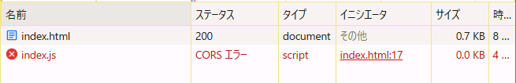
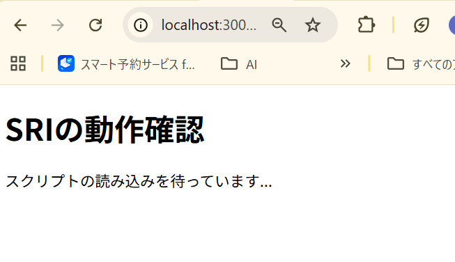
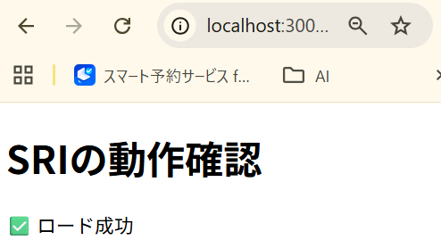
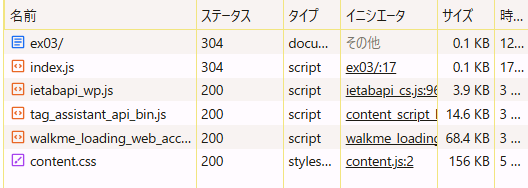

# scriptタグのintegrity属性によるセキュリティ機能

## 検証内容

- integrity属性が正しい場合、スクリプトは正常にロードされる。
- integrity属性が間違っている場合、スクリプトはロードされない。

## 結果

- integrity属性が正しくないとき

  直接htmlを開いたらCORSエラー
  

サーバーたてたら以下


- integrityが正しい時

以下のコマンドでintegrity属性の値を取得

```
cd /home/suguru/oreilly_javascript7_fix/exercises-public/exercises/ch15.01-03/ex03

cat index.js | openssl dgst -sha384 -binary | openssl base64 -A
```

htmlファイルをブラウザで開いてもCORSエラー
`npm run server`でhtmlを開いて実施





## 防御できる攻撃

- CDN等から取得する外部スクリプトが改ざんされた場合、改ざん検知・実行防止が可能。
- サプライチェーン攻撃（依存ライブラリの改ざん）やMITM攻撃（通信途中での改ざん）を防ぐ。
- 信頼できるハッシュ値のみ実行されるため、悪意あるコードの混入リスクを低減できる。
