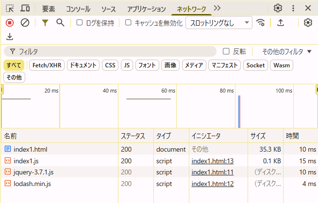

## 4つの書き換えについて要点まとめ

---

1. script タグに `async="true"`を付与

- **ダウンロード:**

  - ブラウザはJSファイルのダウンロードを**バックグラウンド**で開始する。
  - HTMLパーサーはスクリプトのダウンロード完了を待たず、残りのHTMLのパースを続行する。
  - **パースへの影響:** **ブロックしない**

- **実行:**
  - ダウンロードが完了した瞬間、HTMLパーサーの作業を**一時停止**する。
  - ダウンロードされたJSの**実行を開始**し、完了までパーサーは待機する。
  - **パースへの影響:** **一時的に中断する**

> **つまり、ダウンロード中はパースをブロックしないが、実行時は一時的に中断する。**

---

2. script タグに`defer="true"`を付与

- **ダウンロード:**

  - ブラウザはJSファイルのダウンロードを**バックグラウンド**で開始する。
  - HTMLパーサーはスクリプトのダウンロード完了を待たず、残りのHTMLのパースを続行する。
  - **パースへの影響:** **ブロックしない**

- **実行:**
  - HTMLパースが**完全に完了した後**に、JSの実行を開始する。
  - 実行順序は、HTMLに**記述された順**に保たれる。
  - **パースへの影響:** **ブロックしない**

> **つまり、ダウンロード中も実行時もパースをブロックしない。**

---

3. JS内の処理を `document.addEventListener("DOMContentLoaded", () => { ... });` で囲む

`DOMContentLoaded`は、**DOMツリーの構築が完了した**直後に発生するイベント。

- **ダウンロード:**

  - スクリプト自体のダウンロードは、`<script>`タグの**配置**（`head`か`body`か）と**属性**（`async`/`defer`なしの場合、**同期**）に依存する。
  - `<head>`に属性なしで配置した場合、そのファイルのダウンロードと解析が完了するまで、HTMLパースを**ブロックする**。
  - **パースへの影響:** **配置による**（通常はブロックする）

- **実行:**
  - 実行は、HTMLの**パースが完了し、DOMツリーが完全に構築された後**（外部リソースの読み込み完了を待たずに）に開始される。
  - **パースへの影響:** **実行時はブロックしない**（既に完了しているため）

> **つまり、スクリプトのダウンロードと解析のフェーズでブロックが発生する可能性があるが、スクリプト内のメインロジックの実行はDOM構築完了後に遅延される。**

---

### 4. JS内の処理を `window.addEventListener("load", () => { ... });` で囲む

`load`イベントは、**DOM構築に加え、すべての外部リソース（画像、CSSなど）の読み込みが完了した**後に発生します。

- **ダウンロード:**

  - スクリプト自体のダウンロードは、`<script>`タグの**配置**と**属性**に依存する（3.と同じ）。

  * `<head>`に属性なしで配置した場合、そのファイルのダウンロードと解析が完了するまで、HTMLパースを**ブロックする**。
  * **パースへの影響:** **配置による**（通常はブロックする）

- **実行:**
  - 実行は、DOM構築完了と**すべての外部リソースの読み込み完了**という、最も遅いタイミングで開始される。
  - **パースへの影響:** **実行時はブロックしない**（既に完了しているため）

> **つまり、`DOMContentLoaded`よりもさらに遅い、ページ上の**全てのコンテンツが読み込まれた後**にスクリプトが実行される。ダウンロードフェーズでのブロックは配置に依存する。**

## index1.html

### 修正前



helloは表示されない？・・・

### 修正後

調べた結果から推測

_scriptにdeferを付けると最速になる_

```js
$('div#1000').html(_.capitalize('hello'));
```

`＄`からjQueryを使用している。
`_.capitalize`でLodashを使用している。

つまり上記2つがダウンロードされていないと動かない。
defer使うと、

1. ダウンロードはバックグラウンド実行
2. HTMLパース（裏でjQueryとかダウンロードしている）
3. deferは2が完了してからindex1を実行するので安全に操作できる

## index2.html

```js
document.getElementById('1000').innerHTML = 'Hello';
```

**_順番通りに実行するdeferで解決しそう_**

id=100を持つdom要素に依存

つまり、

1. ブラウザがHTMLパースを開始。

2. `script src="./index2.js"`に到達すると、パースが中断します。

3. index2.jsのダウンロードと実行が完了するまで待機します。

4. index2.jsの実行時、`document.getElementById('1000')`が実行されますが、まだ`body`以下の要素（id="1000"を含む）はパースされてない。

5. 要素が見つからないため、`document.getElementById('1000')`は `null` 。

6. `null.innerHTML = 'Hello'` が実行され、エラーが発生し、処理が失敗。

7. HTMLパースは再開し、残りの`body`を構築します。
