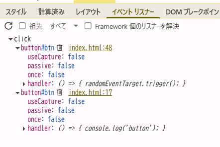

### html を開き、ボタン押下時のコンソール出力結果を確認しなさい。

```
div
button
```

### capture の値を変更し div と button のコンソール出力順序が逆になることを確認しなさい。

true→falseに変更

```
button
div
```

### ブラウザのデバッグツール(Chrome の場合は Developer Tool の Event Listners)で、btn 等に登録されているイベントをそれぞれ確認しなさい。


