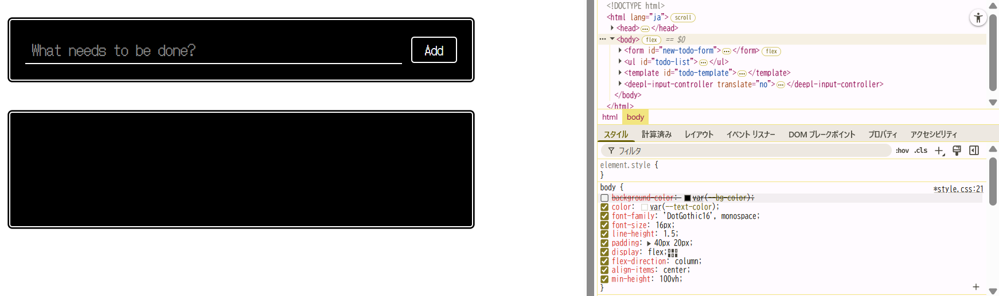
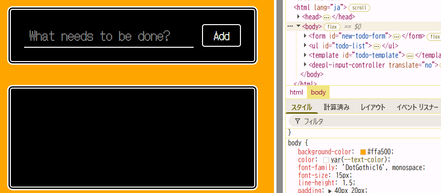
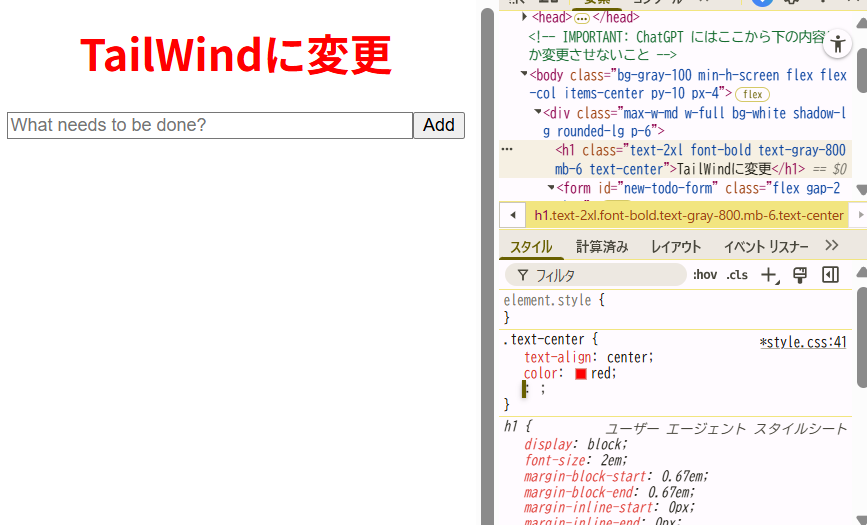
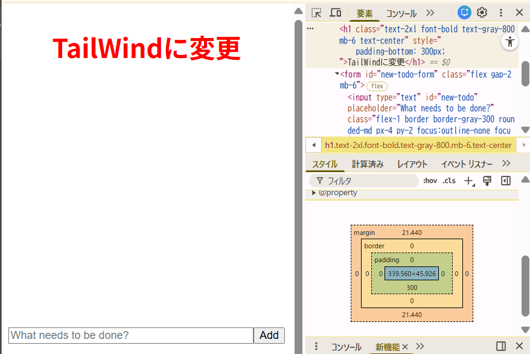
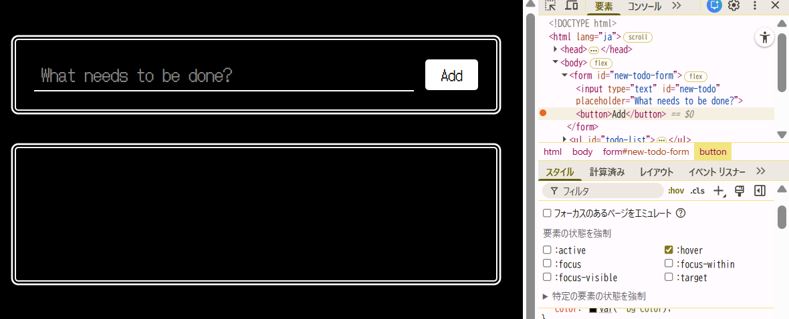
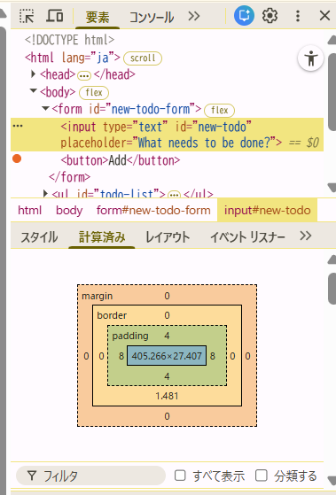
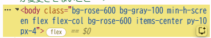
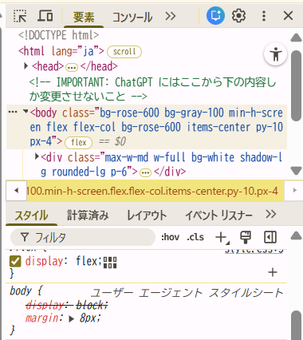

1. 15.4-10.1 および 15.4-10.2 の ToDo アプリに対してブラウザの開発者ツールから値の変更やプロパティの追加を試してみなさい

開発者ツール→スタイルからCSSの変更ができた。

- ex01
  チェックボックス外してCSSオフ
  
  色変更
  
  プロパティ追加（文字の周りに赤色のぼかし）
  

- ex02
  プロパティ追加（文字色を赤）
  

2. 便利だと思ったもの３つ

- marginの設定
  右下の長方形内の数値をいじるとmarginを設定できる。
  

- スタイルの:hov
  チェック付けておくとずっとホバー状態にできる。一定時間で消えてほしくないときに便利そう。
  

- computed(計算済み)
  実際には何pxのmarginなのか？など見ることが出来る。

3. 15.4-10.2 のアプリの `body` 要素に対し、元々 HTML および JS 内で利用していなかった Tailwind CSS のクラス (`bg-rose-600` など何でも良い) を開発者ツールから追加すると変更が反映されないが、これは何故か調べなさい

- やったこと

htmlのbodyのclassに`bg-rose-600`を追加しても変わらない

「スタイル」からbodyにあらたに`bg-rose-600`を追加しようとしたが出来ない。「ユーザーエージェントスタイルシート」になっている？

- 理由
  TailWindCssはビルド時にプロジェクト内で実際に使われているクラス名だけを抽出してCSSファイルを生成する。
  →ビルドの時点で`bg-rose-600`がソースコードにないため、ブラウザが読み込んでいるCSSファイルにも`bg-rose-600`がない。よってブラウザは何を適用すれば良いかわからない状態になっている。
