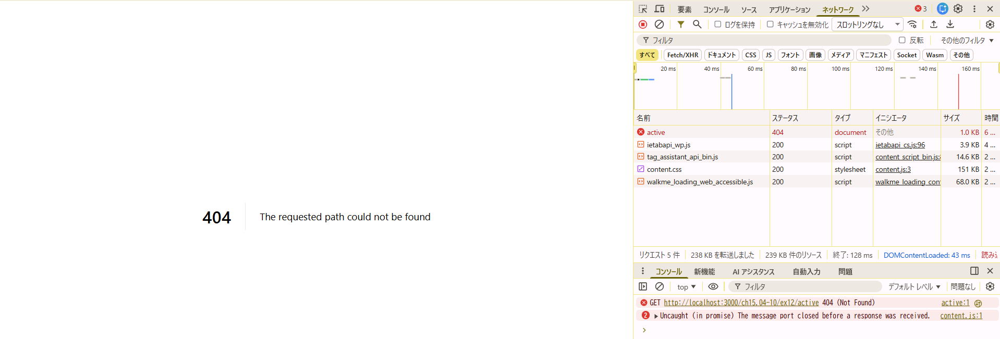
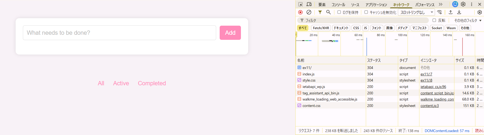

## Active や Completed を選択後にブラウザのリロードを行うとどうなるだろうか。hashchange と pushState それぞれの実装について調べなさい(ヒント: 開発者ツールでどのような通信が発生しているか調べてみなさい)。

pushStateだと更新後に404になった

hashchangeだと今までの入力は全て消え正常にリロード

## なぜ挙動が違うのか

- Hash (#) の場合

ハッシュ（#以降）はサーバーに送信されない。
（http://localhost:3000/ch15.04-10/ex11/#/active）

リロードしてもブラウザはサーバーに `index.html` を要求するだけなので、正常にページが表示（ただしJSの変数はリセットされる）.

- pushState の場合
  リロードするとactiveも含めてサーバーに送信される。
  (http://localhost:3000/ch15.04-10/ex12/active)
  しかしサーバー上には active というファイルは実在しないため、404 Not Found 。

## サーバー側がどのような挙動をすれば pushState を使った実装が期待通り動作するか考えて答えなさい。

404の場合はホーム画面を返すようにサーバー側で設定する（ホーム画面は今回の場合index.html）
