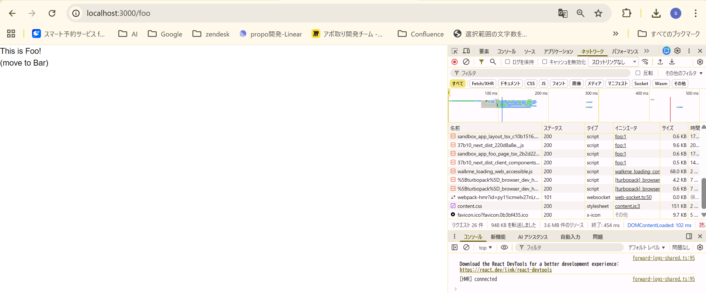
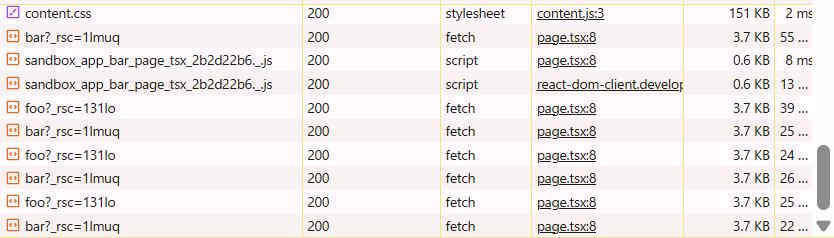
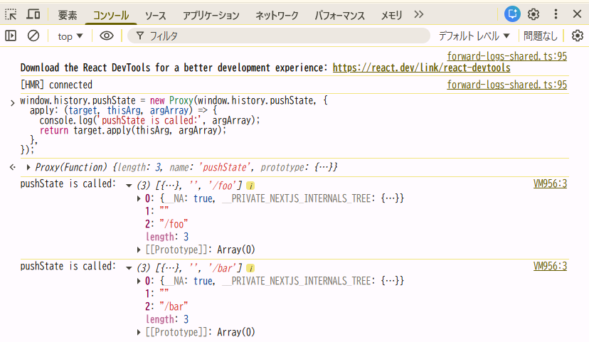
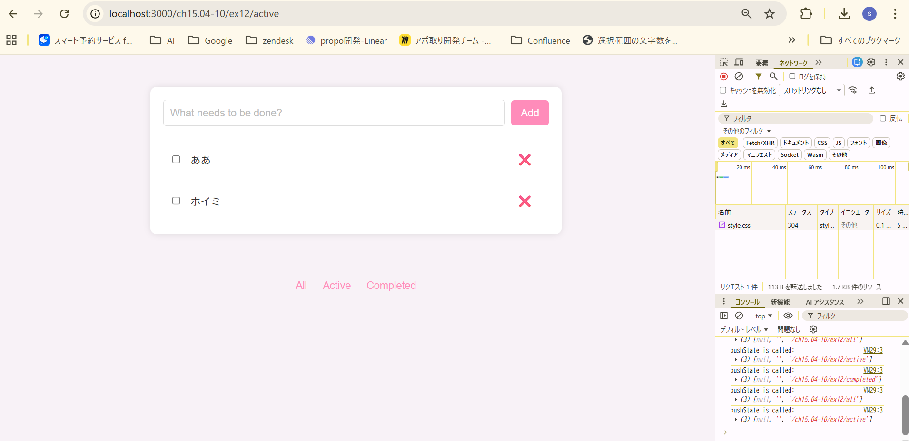
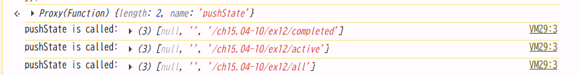

## 以下の動作を確認しなさい

- ブラウザの開発者ツールの「ネットワーク」タブを確認してみよう。リンクをクリックしたときに通信は発生しているだろうか？

通信は発生している。
URLは`localhost:3000`から`localhost:3000/foo`に変化し遷移、リクエスト25件。

そこから`localhost:3000/bar`に遷移すると以下の通信が発生
「http://localhost:3000/_next/static/chunks/sandbox_app_bar_page_tsx_2b2d22b6._.js」が2件
「http://localhost:3000/bar?\_rsc=1lmuq」 が1件

それ以降は
「http://localhost:3000/foo?\_rsc=131lo」と「http://localhost:3000/bar?\_rsc=1lmuq」が一回遷移するたびに1回ずつリクエストされている。

- pushState はいつ実行されているだろうか？

リンクをクリックするタイミングで実行されている。

- リロード時に画面の表示はどうなるだろうか？

元々開いていたページから変わらない。
ネットワークの履歴はリセットされてる。また、開いたページがbarならbarのdocumentが生成され、fooならfooのドキュメントが生成されている。リロード時にURLを見てサーバーサイドレンダリングしてそう。

## 1 で確認した動作と 15.4-10.12 で確認した動作を比較し、next.js の `Link` でどういった処理が行われているかをまとめなさい。

### 15.4-10.12(ex12)でも同様に動作確認

- ブラウザの開発者ツールの「ネットワーク」タブを確認してみよう。リンクをクリックしたときに通信は発生しているだろうか？

発生していない。filterしているだけなのでそれはそうな気がする。

- pushState はいつ実行されているだろうか？

All,Active,Completedを押すタイミングで実行される。
URLは「/active」などに書き変わる。

- リロード時に画面の表示はどうなるだろうか？

「ex12/active」の状態だと404。
「ex12」の状態だと画面リセット。

### 結論

`<Link>`は`pushState`でURLを書き換えている。（ここはex12も同じ）
それと同時に、遷移先ページの情報をfetchして最初に取得したdocumentを書き換えている。（fetchしたデータとの差分のみ更新しているらしい）

リロード時。Next.jsはURLを見てサーバーサイドレンダリングを行い完成品のHTMLを表示するが、ex12はサーバーがURLを認識していないためリロードすると404になる。
