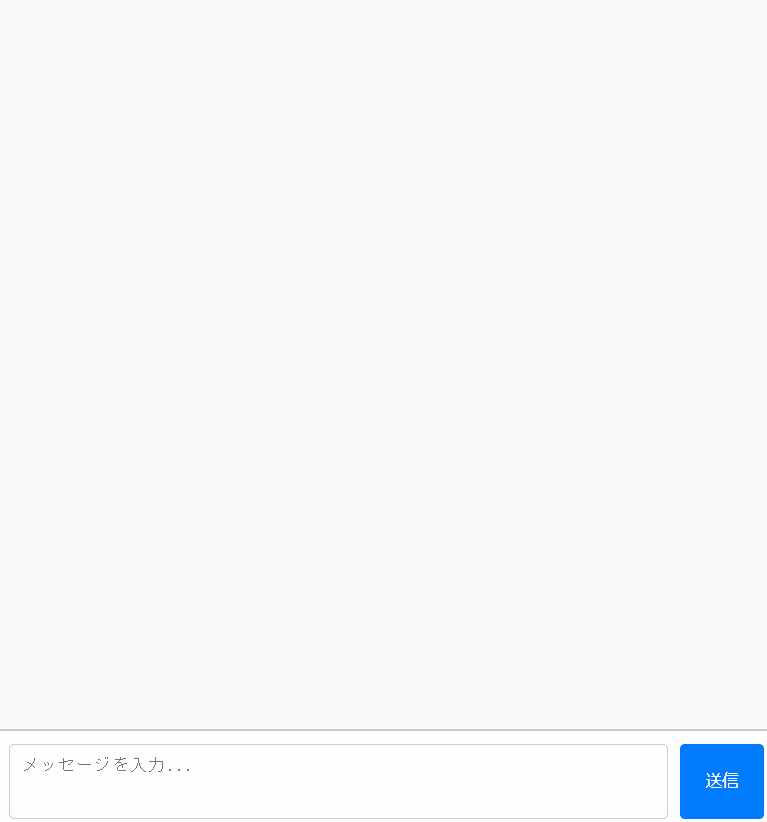

# 練習問題 15 章 15.11-15

## 問題 15.11-15.1 💻🖋️

[15.1-3.1](../ch15.01-03/ex01/) で ToDo 管理アプリケーションを作成したが、ここではこれをサーバ/クライアント型の構成に変更する。
サーバ側はあらかじめ用意してあるので、クライアント側を作成するのが課題となる。

サーバを以下のコマンドで実行し、http://localhost:3000/ にアクセスすると `contents/index.html` のコンテンツをロードすることができる。

```sh
node ex01/server.js
```

このサーバは同じホストの同じポートに以下の仕様の HTTP API を公開している。
リクエスト/レスポンスともに、ボティの Content-Type は `application/json; charset=UTF-8` である。

**オブジェクト仕様**

`Task`: 以下の属性を持つオブジェクトであり、ToDo リストの各項目に該当する

- `id` (`number`): タスクを識別する ID
- `name` (`string`): タスク名
- `status`: (`"active" | "completed"`): タスクの状態

**API 仕様**

タスクの一覧を取得する

- メソッド: `GET`
- パス: `/api/tasks`
- 成功レスポンス
  - ステータスコード: `200`
  - ボディ: 以下の属性を持つオブジェクト
    - `items` (`Task[]`): 現在保持されているタスクの一覧

タスクの ID を指定して取得する

- メソッド: `GET`
- パス: `/api/tasks/{id}`
- 成功レスポンス
  - ステータスコード: `200`
  - ボディ: `Task` オブジェクト

タスクを新規作成する

- メソッド: `POST`
- パス: `/api/tasks`
- リクエスト
  - ボティ: `Task` オブジェクト
    - `name` 属性のみ必要
- 成功レスポンス
  - ステータスコード: `201`
  - ボディ: `Task` オブジェクト
    - `status` の値は `active` である

タスクを一部更新する

- メソッド: `PATCH`
- パス: `/api/tasks/{id}`
- リクエスト
  - ボティ: `Task` オブジェクト
    - ただし、`Task` オブジェクトの `id` 以外の属性の内、更新対象の属性のみがあれば良い
    - リクエストボティに存在しない属性は元の値を維持する
- 成功レスポンス
  - ステータスコード: `200`
  - ボディ: 更新後の `Task` オブジェクト

タスクを削除する

- メソッド: `DELETE`
- パス: `/api/tasks/{id}`
- 成功レスポンス
  - ステータスコード: `204`

なお、上記の API はエラー発生時には以下のレスポンスを返す

- エラーレスポンス
  - ステータスコード: `400` - `499`
  - ボディ: 以下の属性を持つオブジェクト
    - `message` (`string`): エラーメッセージ

**問題**

1. `contents/index.js` を変更し、上記の API を `fetch`を使って呼び出すことで、ToDo リストの状態をクライアントではなくサーバ側で管理する ToDo アプリケーションを完成させなさい。ただし index.html ファイルは編集してはいけない。サーバからエラーレスポンスが返却されたときは、ToDo リストの表示を更新させずエラーの内容を `alert` で表示する。
2. このサーバでは Cookie を使ってクライアントのセッションを識別し、タスク一覧をセッションごとに分離して管理する簡易的な認証/認可を行っている。サーバが設定している Cookie の値は `sid=<セッションに一意に割り当てた ID>; SameSite=Lax; Path=/; HttpOnly;` である。ToDo アプリでいくつかのタスクを作成した後、以下に挙げる操作を実施したとき、それぞれどのような結果になるか記載し、その理由を説明しなさい。
   - index.js で`document.cookie` プロパティを `console.log`で表示する
   - ブラウザの開発者コンソールで http://localhost:3000/ の Cookie を表示する
   - ToDo アプリのタブをリロードする
   - 同一ブラウザの異なるタブやウィンドウで http://localhost:3000/ を開いて ToDo リストの状態を確認する
   - シークレットウィンドウや異なるブラウザで http://localhost:3000/ を開いて ToDo リストの状態を確認する
   - http://127.0.0.1:3000/ を開いて ToDo リストの状態を確認する

**出題範囲: 15.11.1, 15.12.2**

## 問題 15.11-15.2 💻

この問題では、[問題 15.11-15.1](#問題-1511-151-️) と同様な仕様のサーバが用意してある。
ただし、このサーバは、`/api` 以下のパスのリクエストに対して、1/3 ずつの同確率で以下のレスポンスを返す。

- 正常なレスポンス
- ステータスコードが 500 のエラーレスポンス
- レスポンスは正常だが、レスポンスを返すまでに 60 秒かかる

ステータスコードの中にはリトライで成功する可能性があるものがある。

- 4xx クライアントエラー
  - 408 Request Timeout:
  - 429 Too Many Requests
- 5xx サーバーエラー
  - 500 Internal Server Error
  - 502 Bad Gateway
  - 503 Service Unavailable
  - 504 Gateway Timeout

このサーバに対して、以下を満たすように[問題 15.11-15.1](#問題-1511-151-️) で作成した `contents/index.js` を変更しなさい。

- API からリトライで成功する可能性のあるステータスコードレスポンスが返ってきた場合は [問題 11.16](../ch11/README.md#問題-1116-) で作成した `retryWithExponentialBackoff` を流用 (必要に応じて変更) して `fetch` のリトライを行う
- リクエスト送出から 3 秒以上経過してもレスポンスを受信できない場合はリクエストをキャンセルし、リクエストがタイムアウトしたことを `alert` に表示する
- 通信やリトライが完了するまで ユーザが ToDo リストの追加/削除/変更、及びテキストの編集をできないようにする
  - このために `contents/index.html` の変更が必要であれば変更しても良い
- 本来はレスポンスに[`Retry-After`ヘッダ](https://www.rfc-editor.org/rfc/rfc9110.html#name-retry-after)がある場合は指定された時刻以降にリトライすべきだが、この問題では気にしなくて良い

**出題範囲: 15.11.1.1, 15.11.1.９**

## 問題 15.11-15.3 💻

この問題では、[問題 15.11-15.1](#問題-1511-151-️) と同様な仕様のサーバが用意してある。
ただし、このサーバは、3000 ポートで HTML や js などのコンテンツを返すが、HTTP API は 3001 ポートで Listen している。

まず、[問題 15.11-15.1](#問題-1511-151-️) で作成した `contents/index.js` を変更して、`fetch` で `http://localhost:3001/<各 API のパス>` にリクエストを送るように変更しなさい。

上記の変更をした後、開発者コンソールを開いて、http://localhost:3000 にアクセスして見ると、HTTP API のリクエストに対してエラーが発生しているはずである。

エラーは、API の URL に対して `OPTIONS` メソッドのリクエストを送り、レスポンスが 404 のため発生している。
このリクエストは [Preflight リクエスト](https://developer.mozilla.org/ja/docs/Glossary/Preflight_request) と呼ばれるものであり、サーバーが CORS プロトコルに対応しているか確認するためのものである。
その結果、コンソールには CORS のエラーが発生した旨のログが出力されているはずである。

(補足: クロスオリジンリクエストでも、[必ず Preflight リクエストが発生するわけではない](https://developer.mozilla.org/ja/docs/Web/HTTP/CORS#%E3%82%A2%E3%82%AF%E3%82%BB%E3%82%B9%E5%88%B6%E5%BE%A1%E3%82%B7%E3%83%8A%E3%83%AA%E3%82%AA%E3%81%AE%E4%BE%8B))

では、以下の変更を行うことで、 CORS エラーを解消し http://localhost:3000 から http://localhost:3001 の API にリクエストを送信できるようにしなさい。

- `contents/index.js` で、`fetch` のオプション設定を変更し、CORS モードでのリクエスト送信と、クロスオリジンでの Cookie の送信を許可する
- `server.js` で以下の箇所を変更して、`http://localhost:3000` からのクロスオリジンリクエストを許可する

  ```js
  // CORS のヘッダを返すミドルウェア
  function corsMiddleware(_url, _req, res) {
    // TODO: CORS に必要なヘッダを複数設定する
    res.setHeader("TODO", "TODO");
    return true;
  }
  ```

  ```js
  http
    .createServer(async function (req, res) {
      await routes(
        // TODO: この行のコメントを外す
        // ["OPTIONS", "/api/*", nopHandler, cors],
        ["GET", "/api/tasks", listTasksHandler, authz, cors],
        ["GET", "/api/tasks/{id}", getTaskHandler, authz, cors],
        ["POST", "/api/tasks", createTaskHandler, authz, cors],
        ["PATCH", "/api/tasks/{id}", patchTaskHandler, authz, cors],
        ["DELETE", "/api/tasks/{id}", deleteTaskHandler, authz, cors],
      )(req, res);
    })
    .listen(3001);
  ```

**出題範囲: 15.1.8.2, 15.11.1.8**

## 問題 15.11-15.4 💻🧪

[15.1-3.1](../ch15.01-03/ex01/)の ToDo 管理アプリケーションを改造しなさい。
この問題では ToDo のリストをサーバで保存するのではなくブラウザの localStorage に保存し、一度閉じて再度開いても、画面更新しても、ToDo の内容が維持されるようにしなさい。

また、複数のタブで ToDo 管理アプリケーションを開いている状態で、あるタブでの変更が他のタブにも自動的に反映されるようにしなさい。
(例：タブ A とタブ B を開いている状態で、タブ A で ToDo を追加し、タブ B に切り替えると タブ A で追加した ToDo が表示される)

さらに、ブラウザの設定で localStorage を無効化されていてもエラーが表示されずに、そのタブを開いている間だけは正常に動くようにしなさい。localStorage で実現していた機能は動かなくても構わない。

localStorage の無効化方法: https://qiita.com/Udomomo/items/32b1c84807e562b8ce79

**出題範囲: 15.12.1**

## 問題 15.11-15.5 💻🧪

15.1-3.1 の ToDo 管理アプリケーション を indexedDB を用いて、一度閉じて再度開いても、画面更新しても、ToDo の内容が維持されるようにしなさい。

また、複数のタブで ToDo 管理アプリケーションを開いている状態で、あるタブでの変更が他のタブにも自動的に反映されるようにしなさい。
(例：タブ A とタブ B を開いている状態で、タブ A で ToDo を追加し、タブ B に切り替えると タブ A で追加した ToDo が表示される)

**出題範囲: 15.12.3**

## 問題 15.11-15.6 💻🧪🖋️

[問題 15.11-15.4](#問題-1511-154-) の解答を localStorage ではなく sessionStorage を使うように修正しなさい。

localStorage と sessionStorage それぞれに保存されたデータの有効期限がどのように異なるか、実際に動作確認して結果を記述しなさい。

**出題範囲: 15.12.1**

## 問題 15.11-15.7 💻

書籍では一言しか触れられていないが、[ContentSecurity-Policy (CSP)](https://developer.mozilla.org/ja/docs/Web/HTTP/CSP) はクロスサイトスクリプティング (XSS) やデータインジェクションなどのリスクを軽減するための仕組みで、主にブラウザ上のコンテンツの読み込みを信頼されたコンテンツのみに制限することで実現される。

CSP には様々なディレクティブが存在するが、その中の `script-src` ディレクティブによって有効な JavaScript のソースを指定することができる。

この問題においても、サーバを `node ex07/server.js` のコマンドで実行し、http://localhost:3000/ にアクセスすると `contents/index.html` のコンテンツをロードすることができる。

このコンテンツをブラウザで表示すると、"RICOH", "Hello", "World" の 3 つのアラートを表示するようになっている。
`server.js` の以下の箇所を変更して CSP ヘッダを設定することで、"RICOH" および "Hello" のアラートは表示されるが、 "World" のアラートは表示されないようにしなさい。

```js
// CSP のヘッダを返すミドルウェア
function cspMiddleware(_url, req, res) {
  // TODO: CSP ヘッダを設定する
  // res.setHeader("Content-Security-Policy", "TODO");
  return true;
}
```

**出題範囲: 15.15.3**

## 問題 15.11-15.8 💻

`ex08/server.js`は、以下の仕様の WebSocket サーバである。

- 以下のようなスキーマのリクエストメッセージを受け取る
  ```json
  {
    "requestId": 123, // リクエストを識別するID
    "type": "request",
    "payload": "任意の文字列"
  }
  ```
- 上記のスキーマのメッセージに対して以下のレスポンスメッセージを返す

  ```json
  {
    "requestId": 123, // 受け取ったリクエストIDをそのまま返す
    "type": "response",
    "payload": "Hello, <リクエストのpayloadで受け取った文字列>"
  }
  ```

- ただし、`type"`が`"request"`でなかったり、`payload`が文字列でなかったり空だった場合は以下のエラーメッセージを返す
  ```json
  {
    "requestId": 123, // 受け取ったリクエストIDをそのまま返す
    "type": "error",
    "payload": "Invalid Request"
  }
  ```
- リクエストを受け取ってからレスポンスを返すまで 0-5 秒の遅延が発生する
- ポート 3003 で listen する

このサーバは以下のコマンドで起動できる。

```sh
node ex08/server.js
```

このサーバと通信するクライアントを作りなさい。
`index.html` は用意してあるので、この HTML ファイルから読み込まれれて実行される `index.js` を作りなさい(`index.ts` からコンパイルするのも可)。

仕様は以下とする。
「リクエスト 1」/「リクエスト 2」/「リクエスト 3」を「リクエスト N」、「レスポンス 1」「レスポンス 2」「レスポンス 3」を「レスポンス N」と総称する。

- 「Send Request」が押された場合

  - それぞれの「リクエスト N」に入力されたテキストを、リクエストメッセージの`payload`として一斉にサーバに送信する
  - それぞれの「レスポンス N」に`Loading...`を表示する

- サーバからレスポンスメッセージを受信したした場合

  - 送信したリクエストに対応する「レスポンス N」に、レスポンスメッセージの`payload`の文字列をそのまま表示する

- サーバからエラーメッセージを受信したした場合

  - 送信したリクエストに対応する「レスポンス N」に、`Error: <レスポンスメッセージのpayload>`を表示する

- 上記以外のエラーとして、送信したリクエストに対応する「レスポンス N」に以下を表示する
  - 3 秒以内にレスポンスが返ってこなかった場合をエラーとして扱い、`Error: Request timed out`を表示する (その後レスポンスメッセージを受け取ってもエラーのまま)
  - レスポンスを受取前に WebSocket の接続が切断された場合、`Error: Connection Closed`を表示する

`index.html` の抜粋

```html
<div class="request">
  <label for="payload1">リクエスト1:</label>
  <!-- このinputに入力されたテキストを送信する -->
  <input type="text" id="payload1" class="payload" /><br />

  <label for="response1">レスポンス1:</label>
  <!-- レスポンスまたはエラーをこのpのテキストコンテントに表示 -->
  <p id="response1" class="response"></p>
</div>
```

**出題範囲: 15.11.3**

## 問題 15.11-15.9 💻

15.4-10.10 で作成したライフゲームについて、WebSocket を利用して多人数で同期してプレイできるようにしなさい。
サーバ側はあらかじめ用意してあるので、クライアント側を作成するのが課題となる。

[ex09/server.js](ex09/server.js) は、ライフゲームの盤面情報を管理し WebSocket でクライアントと送受信する WebSocket サーバーである。

15.4-10.10 で実装した updateGrid メソッドを server.js にも実装し、以下のコマンドで実行すると ws://localhost:3003 で WebSocket サーバが起動する。

```sh
node ex09/server.js
```

このサーバでは、ゲームが開始されると 1 秒に 10 回盤面を更新し、以下のメッセージをすべてのクライアントに送信する。

```json
  {
    "type": "update",
    "grid": {盤面を表すboolean二次元配列}
  }
```

また、クライアントからは WebSocket で以下のメッセージを受信し、ゲームの盤面・進行状態に反映する。

- セルの反転（盤面クリック時）

```json
  {
    "type": "toggle",
    "row": {セルの行数},
    "col": {セルの列数}
  }
```

- ゲームの一時停止

```json
{
  "type": "pause"
}
```

- ゲームの開始・再開

```json
{
  "type": "start"
}
```

**出題範囲: 15.11.3**

## 問題 15.11-15.10 💻

[問題 15.4-10.9](../ch15.04-10/README.md) の画像変換処理を、Web Worker で処理するように修正しなさい。
可能であればページ内に動くオブジェクトを配置し、画像変換中にメインスレッドがブロックされていないことを確認しなさい。

**出題範囲: 15.13**

## 問題 15.11-15.11 💻

指定したファイルを OneDrive へアップロードするページを作成しなさい。
API を実行するためのアクセストークンは、[Graph Explorer](https://developer.microsoft.com/en-us/graph/graph-explorer) で取得したものをユーザが入力できるようにしなさい。

**出題範囲: 15.11.1**

## 問題 15.11-15.12 💻

[Ollama](https://ollama.com/) はローカル環境で LLM が使えるツールである。
Ollama を使って、生成 AI とのチャットできる Web アプリケーションを作りなさい。

LLM のモデルは[gemma:2B](https://ollama.com/library/gemma) 程度を用いなさい。以下のコマンドでローカル環境に LLM(gemma:2B) が起動する。

```
ollama run gemma:2b
```

ローカル環境に LLM のモデルが起動すると、Ollama の[REST API](https://github.com/ollama/ollama?tab=readme-ov-file#rest-api)が使用できる。

[Generate a chat completion](https://github.com/ollama/ollama/blob/main/docs/api.md#generate-a-chat-completion) API を使って、LLM の応答を逐次表示する以下のような UI をもつ Web アプリケーションを実装しなさい。逐次表示に関連するパラメータは`stream`パラメータである(デフォルトで有効)。



**出題範囲: 15.11.1**

## 問題 15.11-15.13 💻

EventSource でサーバーからメッセージを受信し、表示する UI を実装しなさい。

問題 15.11-15.01 と同様にサーバーは用意している。起動方法も同様である。

http://localhost:3000/message にリクエストすると EventSource でメッセージを受信できる。

index.js のコードを完成させて、通信ボタンを押下するとサーバーと通信を開始し、
通信中は通信ボタンが非活性になるように実装しなさい。

**出題範囲: 15.11.2**

## 問題 15.11-15.14 🖋

Slack や O365 の API は機密情報をヘッダーで指定する。パスやクエリでないのは何故かセキュリティの観点で記載しなさい。

**出題範囲: 15.11.1**

## 問題 15.11-15.15 🖋️

オリジン間リソース共有（CORS）について、以下の問いに答えなさい。

1. クロスオリジンリクエストに制約が無かった場合、どのような問題が発生するか述べなさい
2. クロスオリジンリクエストで メソッド(`POST`/`GET`)やリクエストの内容によって Preflight リクエストの有無が異なるのは何故か、その理由を述べなさい

**出題範囲: 15.11.1**

## 問題 15.11-15.16 🖋

実際のサービスの通信をデベロッパーツールで調査し、 ブラウザから呼び出し可能なAPIの CORS の設定を確認しなさい。

**出題範囲: 15.11.1**
