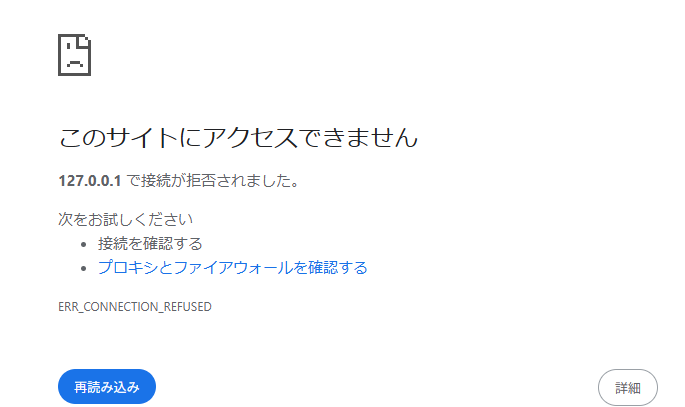

### index.js でdocument.cookie プロパティを console.logで表示する

HttpOnlyがあるので、sidは見えないようになっている。

```
_ga=GA1.1.1693283889.1759374649; _clck=1jxlme1%5E2%5Eg33%5E0%5E2101; _ga_Z18KPWRTJS=GS2.1.s1769577960$o20$g1$t1769579095$j60$l0$h0
```

Cookie は「ドメイン（この場合は localhost）」単位で保存され、有効期限が切れるまでブラウザに残りるため、別プロジェクトで開発したときのHttpOnlyがついていないCookieが表示されている

### ブラウザの開発者コンソールで http://localhost:3000/ の Cookie を表示する

applicationからCookieを確認。


sidが見れる。
「**ブラウザが**内部的に保持している Cookie ストレージ」を直接表示できる。
つまり、HttpOnlyの有無によらず、ブラウザが保存している全てのCookieを確認できる。

### ToDo アプリのタブをリロードする同一ブラウザの異なるタブやウィンドウで http://localhost:3000/ を開いて ToDo リストの状態を確認する

元のTodoアプリの状態を、別タブでも引き継いでいる。
同一ブラウザ内の同一ドメインに対するCookieは共有される。
新しいタブを開いても、ブラウザは既に持っているlocalhost用のsidCookieを送信するので、サーバーは同一セッションとして扱う

### シークレットウィンドウや異なるブラウザで http://localhost:3000/ を開いて ToDo リストの状態を確認する

初期化されて表示された
Cookie共有されないから。

### http://127.0.0.1:3000/ を開いて ToDo リストの状態を確認する

開けない。。・？
本当は繋がるらしい。


ブラウザは「URLの文字」を見てセキュリティ管理している。
よって同じ場所を指していても、別のWebサイトとして扱うのでlocalhostで保存されたCookieは127.0.0.1には送信されない。
