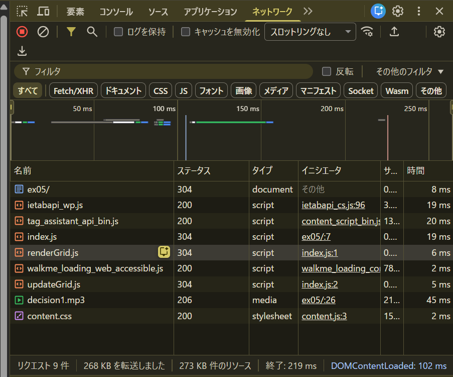
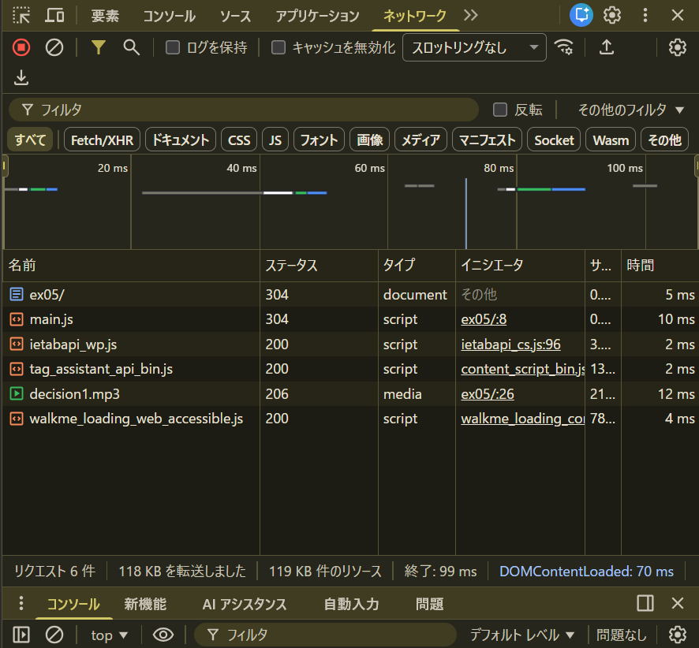

↓でバンドルした

`npx webpack ./ex05/index.js --mode production --output-path ./ex05/dist`

# バンドル前とバンドル後のコード比較
prettier playgroundでバンドル後のファイルを整形して比較
`ex05/compare_bundle/bundle.js`に記載。

# スクリプトのダウンロード時間、ページの読み込み完了時間の比較
## バンドル前

- index.js：19 ms
- renderGrid.js：6 ms
- updateGrid.js ： 5 ms

合計3ファイルが別々にリクエストされている

- 終了：219ms

## バンドル後
ex05/index.html を書き換え  にする。
（deferとtype="modeule"が同じ挙動なので公平）
それから`npm run build`実行

- main.js 10ms

バンドルしたので1ファイルでまとめてリクエスト

- 終了 99ms

### 結論

バンドルした方がパフォーマンスが良さそう