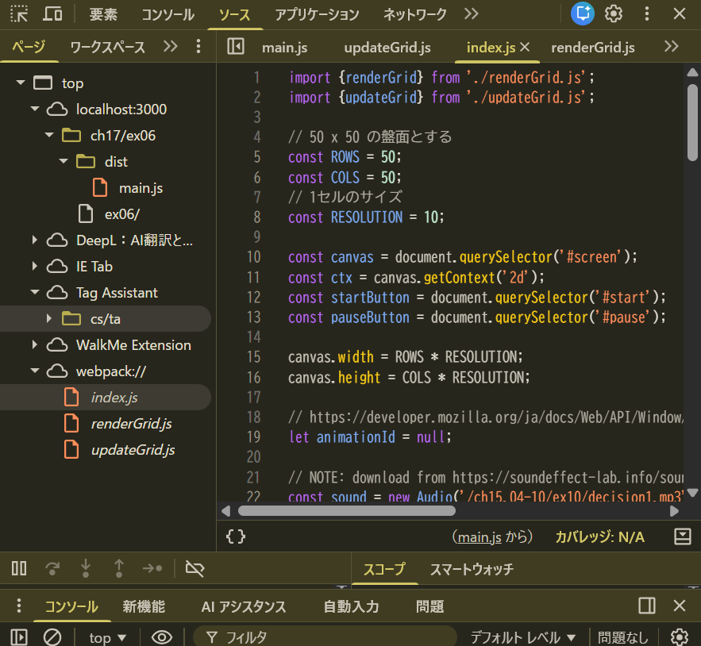
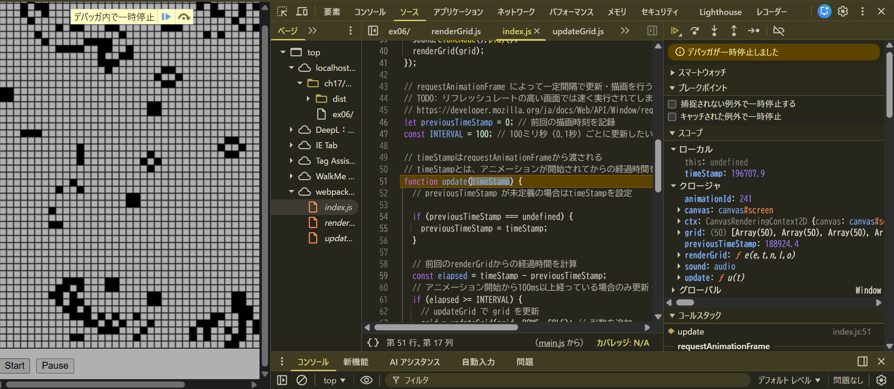

## 実施内容

### webpack.configでソースマップを生成

`webpack.config.js`に以下を設定：
```javascript
devtool: 'source-map'
```

https://qiita.com/kashi-minn/items/86716c5a6f87660b9c9d

### ビルド実行

```bash
npx webpack
```

dist以下にバンドル後のファイルとソースマップが生成される

## デバッグ確認手順

### ローカルサーバー起動
```bash
npm run serve
```

ブラウザで `http://localhost:3000/ch17/ex06/index.html` にアクセス

### 開発者ツールでの確認



ソースマップがあるおかげで、`webpack://`配下にバンドル前のコードが配置されている。
ソースマップは関係ないが、バンドル後のファイルが整形された形で見ることができる（Prettierの整形いらなかった）



デバッカも使えてそう。
ブレークポイントや変数の値の確認などができてそう。（デバッカー使いこなせなさそう）


- 本番環境では最適化されたコードを使用
- 開発時は元のコードでデバッグ可能
- エラー発生時も元のファイル・行番号が分かりそう
